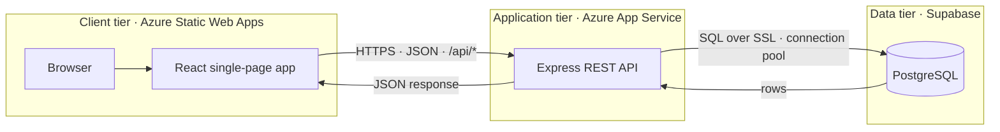
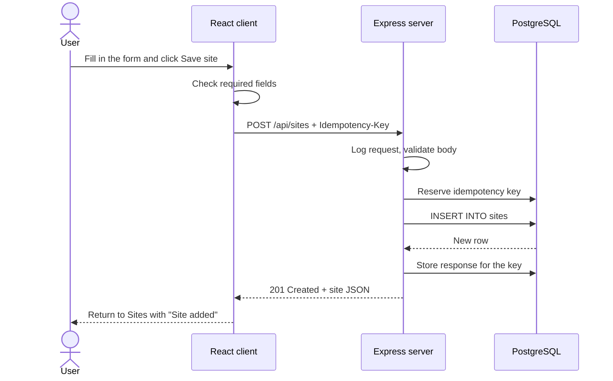
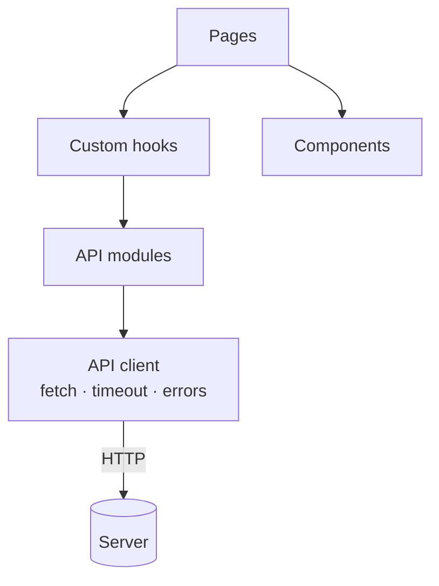
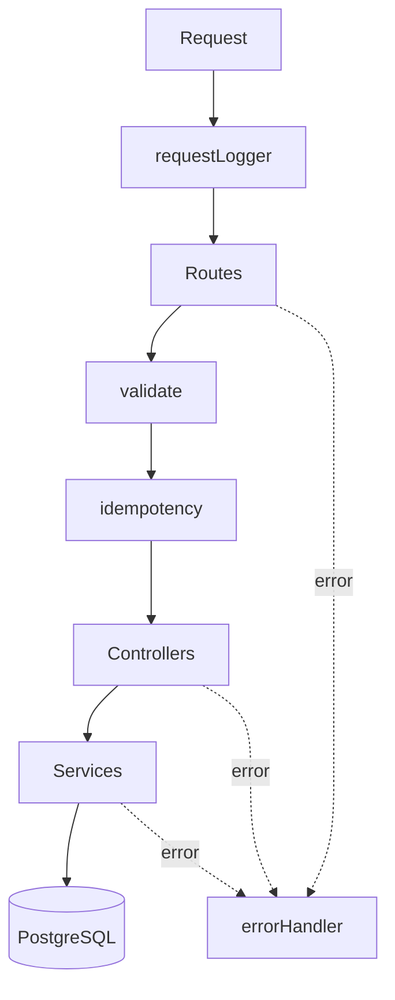
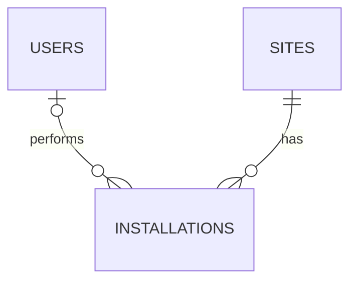

# Site Operations Dashboard

A full-stack dashboard for managing operational sites, tracking equipment installations and viewing operational summaries. Built with React, Node.js and PostgreSQL, and designed to be deployed on Microsoft Azure.

## Features

- **Overview dashboard** with summary cards, an installations-by-status donut chart, an installations-per-month bar chart and the latest installations
- **Sites**: list, search by name or city, filter by status and region, add, edit and delete
- **Installations**: list, search by equipment or technician, filter by site and status, add, edit and delete
- **Server-side pagination** with a selectable page size
- **Validation** in the browser and on the server, with errors shown under each form field
- **Safe retries**: create requests carry an `Idempotency-Key`, so a repeated submit never creates a duplicate
- **Structured logging** with a request id on every log line and response
- **Responsive layout** with a sidebar on desktop and a slide-in menu on mobile

## Tech stack

| Layer | Technology |
|---|---|
| Frontend | React 19, Vite, React Router 7, Material UI 9, MUI X Charts |
| Backend | Node.js 20+, Express 5, `pg`, Zod, Pino |
| Database | PostgreSQL hosted on Supabase |
| Hosting | Azure Static Web Apps (frontend), Azure App Service (backend) |

## Requirements coverage

| Requirement | Implementation |
|---|---|
| **Frontend:** responsive dashboard with summary cards | Overview page with four summary cards and two charts; layout adapts from desktop sidebar to mobile menu |
| **Frontend:** site listing page, search, filtering | Sites page with debounced search, status and region filters, server-side pagination |
| **Frontend:** form-based data entry | Add and edit forms for sites and installations with field-level validation |
| **Frontend:** React Hooks and REST API integration | `useState`, `useEffect`, `useCallback` plus custom hooks (`usePaginatedList`, `useEntityForm`, `useDeleteConfirmation`, `useFlashMessage`) calling the API through a single `fetch` client |
| **Backend:** REST CRUD for sites and installations | `GET`, `POST`, `PUT`, `DELETE` on `/api/sites` and `/api/installations` |
| **Backend:** validation | Zod schemas for every body, query string and route parameter |
| **Backend:** error handling | One central error handler, consistent `{ message, errors }` responses, PostgreSQL error codes mapped to 400 / 409 |
| **Backend:** logging | Pino with one line per request, level by status code, request ids, redacted secrets |
| **Database:** normalized `Sites`, `Installations`, `Users` tables | Third normal form with foreign keys, check constraints and delete rules |
| **Database:** joins, aggregations, optimized queries | Joins across all three tables, `COUNT ... FILTER`, window functions, `generate_series`; foreign-key indexes, parallel queries and SQL-side aggregation |
| **Azure:** deployment with environment variables | Frontend on Static Web Apps, backend on App Service; all configuration through environment variables |
| **API:** GET/POST for sites and installations plus a summary endpoint | `/api/sites`, `/api/installations`, `/api/summary` |
| **Source control:** Git and README | This repository and README; commits follow the Conventional Commits style |

## Client-server architecture

The application follows a three-tier client-server architecture. The client renders the interface and never touches the database. The server owns every rule and every query. The database stores the data and is reachable only from the server.



### Tiers

| Tier | Runs on | Technology | Responsibility |
|---|---|---|---|
| Client | The user's browser, served by Azure Static Web Apps | React, React Router, Material UI | Renders pages, holds UI state, checks forms before sending, calls the API, shows results and errors |
| Application server | Azure App Service | Node.js, Express | Validates every request, applies business rules, runs SQL, enforces idempotency, logs requests, returns JSON |
| Database | Supabase | PostgreSQL | Stores users, sites and installations; enforces keys, constraints and delete rules |

### Responsibilities

| Concern | Client | Server |
|---|---|---|
| Rendering pages | ✅ | |
| Navigation between pages | ✅ React Router | |
| Form checks for instant feedback | ✅ | |
| Authoritative validation | | ✅ Zod schemas |
| Search, filtering, pagination | Sends the parameters | ✅ Runs them in SQL |
| Summary metrics | Draws the cards and charts | ✅ Aggregates in SQL |
| Database access | Never | ✅ Only through the connection pool |
| Error messages | Shows them | ✅ Produces them in one error handler |
| Duplicate submit protection | Sends an `Idempotency-Key` | ✅ Stores and replays responses |
| Logging | | ✅ One line per request with a request id |
| Secrets (database password, certificate) | Never | ✅ Environment variables only |

Validation runs on both sides on purpose. The client check gives instant feedback; the server check is the one that counts, because any request can bypass the browser.

### Communication contract

| Aspect | Rule |
|---|---|
| Protocol | HTTPS in production |
| Style | REST: resources are nouns (`/sites`, `/installations`), actions are HTTP methods |
| Format | JSON request and response bodies, camelCase fields |
| Base URL | `/api`. In development Vite forwards it to `localhost:5000`; in production `VITE_API_URL` points to App Service |
| Cross-origin access | The server allows only `CORS_ORIGIN` and exposes `X-Request-Id` and `Idempotent-Replayed` |
| Lists | `?page=&limit=&search=&...` → `{ data, pagination }` |
| Errors | `{ message, errors? }` with a matching HTTP status |
| Request headers | `Content-Type: application/json`, `Idempotency-Key` on create requests |
| Response headers | `X-Request-Id` on every response |
| State | Stateless. Each request carries everything the server needs, so App Service can run more than one instance. |

### Request lifecycle

Saving a new site from the Add site form:



If anything fails, the server's error handler returns `{ message, errors }` and the client shows it as a red message under the field or at the top of the form.

### Client structure



| Layer | Folder | Role |
|---|---|---|
| Pages | `src/pages` | One component per screen; composes hooks and components |
| Components | `src/components` | Reusable UI: layout, tables, dialogs, filters |
| Hooks | `src/hooks` | Reusable state logic: pagination, forms, delete confirmation, flash messages |
| API modules | `src/api` | One function per endpoint |
| API client | `src/api/client.js` | Builds URLs, sends requests, applies the 15-second timeout, converts failures into readable messages |

### Server structure



| Layer | Folder | Role |
|---|---|---|
| Middleware | `src/middleware` | Logging, validation, idempotency, not found, error handling |
| Routes | `src/routes` | Map each URL and method to its middleware and controller |
| Controllers | `src/controllers` | Read the validated request and send the response; no SQL |
| Services | `src/services` | All SQL and business rules; no knowledge of HTTP |
| Validators | `src/validators` | Zod schemas for bodies, query strings and route parameters |
| Config | `src/config` | Environment variables and the database connection pool |

## Project structure

```
site-operation-dashboard/
├── frontend/                 React application
│   ├── public/               favicon, Static Web Apps routing config
│   └── src/
│       ├── api/              fetch client and one module per resource
│       ├── components/       Layout, tables, dialogs, form and filter controls
│       ├── hooks/            reusable data, form and dialog logic
│       ├── pages/            Overview, Sites, Installations and their forms
│       └── styles/           MUI theme and global layout styles
├── backend/                  Express API
│   ├── scripts/              database migration and seed runners
│   └── src/
│       ├── config/           environment and database connection
│       ├── routes/
│       ├── controllers/
│       ├── services/
│       ├── validators/
│       ├── middleware/
│       └── utils/
├── database/
│   ├── migrations/           numbered schema scripts
│   ├── seeds/                sample data
│   └── queries/              join and aggregation examples
└── docs/
    ├── backend.md            API reference, idempotency, logging, Supabase
    └── database.md           ER diagram, relationships, normalization
```

## Getting started

### Prerequisites

- Node.js 20.11 or later
- A PostgreSQL 14+ database. The project uses [Supabase](https://supabase.com); any PostgreSQL server works.

### 1. Set up the database

1. Create a Supabase project.
2. In **Connect**, copy the **Session pooler** connection string.
3. In **Database Settings → SSL Configuration**, download the CA certificate and save it as `backend/certs/supabase-ca.crt`.

### 2. Configure and start the backend

```bash
cd backend
npm install
cp .env.example .env
```

Fill in `.env`:

| Variable | Description |
|---|---|
| `NODE_ENV` | `development` for readable, coloured logs |
| `PORT` | API port, defaults to `5000` |
| `DATABASE_URL` | Supabase session pooler connection string |
| `DATABASE_SSL` | `true` for Supabase, `false` for a local database without SSL |
| `DATABASE_SSL_CA` | Path to the CA certificate, required when `DATABASE_SSL` is `true` |
| `CORS_ORIGIN` | Frontend URL, `http://localhost:5173` locally |
| `LOG_LEVEL` | `debug`, `info`, `warn` or `error` |

Create the tables and load the sample data, then start the API:

```bash
npm run db:migrate
npm run db:seed
npm run dev
```

Check it is running: `http://localhost:5000/api/health` returns `{ "status": "ok", "database": "connected" }`.

### 3. Start the frontend

```bash
cd frontend
npm install
npm run dev
```

Open `http://localhost:5173`. In development Vite forwards `/api` requests to `http://localhost:5000`, so no frontend configuration is needed.

## Scripts

| Folder | Command | Description |
|---|---|---|
| `backend` | `npm run dev` | Start the API with automatic restart |
| `backend` | `npm start` | Start the API in production mode |
| `backend` | `npm run db:migrate` | Run `database/migrations` in order; safe to run again |
| `backend` | `npm run db:seed` | Reset the tables and load sample data |
| `frontend` | `npm run dev` | Start the Vite development server |
| `frontend` | `npm run build` | Build the production bundle into `frontend/dist` |
| `frontend` | `npm run preview` | Serve the production build locally |

## API

All endpoints are under `/api` and use JSON.

| Method | Endpoint | Description |
|---|---|---|
| GET | `/health` | API and database status |
| GET | `/summary` | Totals, status breakdown, monthly counts, recent installations |
| GET | `/sites` | Paginated list with `search`, `status`, `region` |
| GET | `/sites/:id` | One site |
| POST | `/sites` | Create a site |
| PUT | `/sites/:id` | Update a site |
| DELETE | `/sites/:id` | Delete a site and its installations |
| GET | `/installations` | Paginated list with `search`, `siteId`, `status` |
| GET | `/installations/:id` | One installation |
| POST | `/installations` | Create an installation |
| PUT | `/installations/:id` | Update an installation |
| DELETE | `/installations/:id` | Delete an installation |
| GET | `/users?role=technician` | Technicians for the installation form |

Paginated responses:

```json
{
  "data": [],
  "pagination": { "page": 1, "limit": 10, "total": 112, "totalPages": 12 }
}
```

Error responses:

```json
{ "message": "Please fix the highlighted fields.", "errors": { "name": "Enter a site name." } }
```

Full request and response examples, validation rules, error codes, idempotency and logging are in [docs/backend.md](docs/backend.md).

## Database



| Relationship | Type |
|---|---|
| `sites` → `installations` | One-to-many, required. Deleting a site deletes its installations. |
| `users` → `installations` | One-to-many, optional. Deleting a user keeps the installations as unassigned. |
| `sites` ↔ `users` | Many-to-many through `installations` |

Example queries demonstrating joins and aggregations are in `database/queries`. The full ER diagram, column definitions and normalization notes are in [docs/database.md](docs/database.md).

## Deployment on Azure

### Backend: Azure App Service

1. Create a **Linux** App Service with the **Node 20 LTS** runtime or later.
2. Deploy the `backend` folder, including `certs/supabase-ca.crt`.
3. Under **Configuration → Application settings**, add:

   | Setting | Value |
   |---|---|
   | `NODE_ENV` | `production` |
   | `DATABASE_URL` | Supabase session pooler connection string |
   | `DATABASE_SSL` | `true` |
   | `DATABASE_SSL_CA` | `certs/supabase-ca.crt` |
   | `CORS_ORIGIN` | The Static Web Apps URL, for example `https://<name>.azurestaticapps.net` |
   | `LOG_LEVEL` | `info` |

   App Service sets `PORT` automatically.
4. Set the **startup command** to `npm start`.
5. Under **Health check**, set the path to `/api/health`.
6. Run `npm run db:migrate` and `npm run db:seed` once against the production database.

Logs are written as JSON to stdout and can be viewed with **Log stream** or queried in Log Analytics.

### Frontend: Azure Static Web Apps

1. Create a Static Web App connected to this repository.
2. Build settings:

   | Setting | Value |
   |---|---|
   | App location | `frontend` |
   | Output location | `dist` |

3. Add the build environment variable `VITE_API_URL` with the App Service URL, for example `https://<name>.azurewebsites.net`. Vite reads it at build time.

`frontend/public/staticwebapp.config.json` sends every route to `index.html`, so links such as `/sites/3/edit` work after a page refresh.

## Design decisions

| Decision | Reason |
|---|---|
| Plain SQL with `pg` instead of an ORM | Keeps joins and aggregations visible and reviewable |
| Server-side pagination, search and filtering | The browser only loads one page of rows, however large the tables grow |
| Material UI with a custom theme | Accessible, consistent components; styling lives in one theme file instead of inline styles |
| Idempotency keys on create requests | A retried or double-submitted form never creates a duplicate record |
| Row Level Security on every table | Blocks Supabase's automatic public REST API; the backend connects as the owner and is unaffected |
| Session pooler connection | Works over IPv4 from Azure App Service and suits a long-running server |
| Central error handler | One place turns errors into responses, so controllers stay short and no stack trace reaches the client |

## Known limitations

- There is no authentication; every visitor can view and edit data.
- There are no automated tests. The API was verified manually against a real PostgreSQL instance.
- Supabase free-tier projects pause after seven days without activity and must be restored from the Supabase dashboard.

## Commit convention

Commits follow [Conventional Commits](https://www.conventionalcommits.org):

```
feat: add installations list with server-side pagination
fix: return 409 when a site name already exists
docs: add database ER diagram
```
