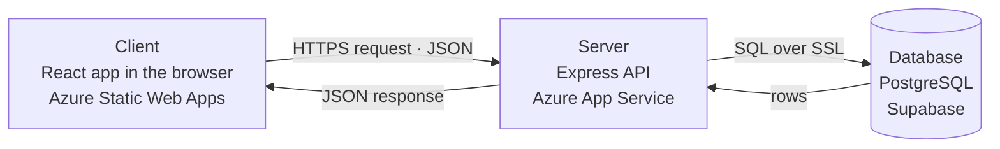
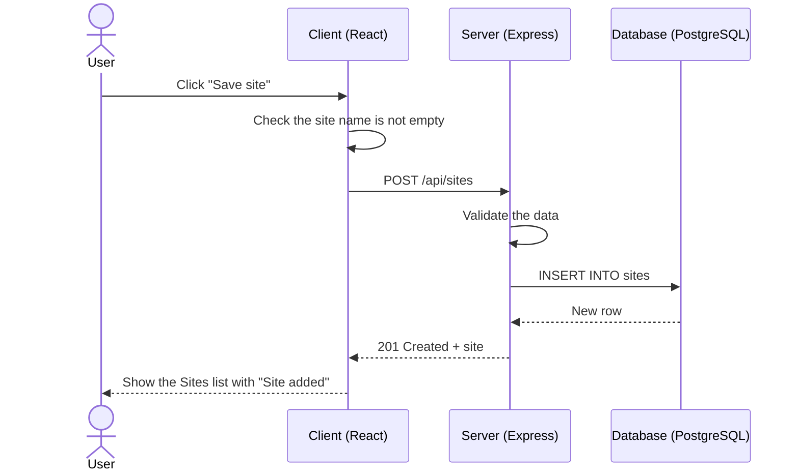
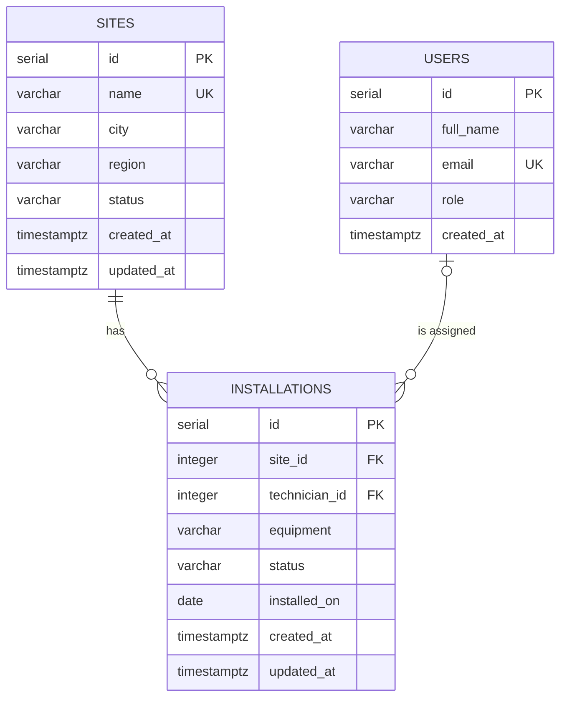

# Site Operations Dashboard

A full-stack dashboard for managing operational sites, tracking equipment installations and viewing operational summaries. Built with React, Node.js and PostgreSQL, and designed to be deployed on Microsoft Azure.

## Features

- **Overview dashboard** with summary cards, an installations-by-status donut chart, an installations-per-month bar chart and the latest installations
- **Sites**: list, search by name or city, filter by status and region, add, edit and delete
- **Installations**: list, search by equipment or technician, filter by site and status, add, edit and delete
- **Server-side pagination** with a selectable page size
- **Validation** in the browser and on the server, with errors shown under each form field
- **Safe retries**: create requests carry an `Idempotency-Key`, so a repeated submit never creates a duplicate
- **Structured logging** with a request id on every log line and response
- **Responsive layout** with a sidebar on desktop and a slide-in menu on mobile

## Tech stack

| Layer | Technology |
|---|---|
| Frontend | React 19, Vite, React Router 7, Material UI 9, MUI X Charts |
| Backend | Node.js 20+, Express 5, `pg`, Zod, Pino |
| Database | PostgreSQL hosted on Supabase |
| Hosting | Azure Static Web Apps (frontend), Azure App Service (backend) |

## Requirements coverage

| Requirement | Implementation |
|---|---|
| **Frontend:** responsive dashboard with summary cards | Overview page with four summary cards and two charts; layout adapts from desktop sidebar to mobile menu |
| **Frontend:** site listing page, search, filtering | Sites page with debounced search, status and region filters, server-side pagination |
| **Frontend:** form-based data entry | Add and edit forms for sites and installations with field-level validation |
| **Frontend:** React Hooks and REST API integration | `useState`, `useEffect`, `useCallback` plus custom hooks (`usePaginatedList`, `useEntityForm`, `useDeleteConfirmation`, `useFlashMessage`) calling the API through a single `fetch` client |
| **Backend:** REST CRUD for sites and installations | `GET`, `POST`, `PUT`, `DELETE` on `/api/sites` and `/api/installations` |
| **Backend:** validation | Zod schemas for every body, query string and route parameter |
| **Backend:** error handling | One central error handler, consistent `{ message, errors }` responses, PostgreSQL error codes mapped to 400 / 409 |
| **Backend:** logging | Pino with one line per request, level by status code, request ids, redacted secrets |
| **Database:** normalized `Sites`, `Installations`, `Users` tables | Third normal form with foreign keys, check constraints and delete rules |
| **Database:** joins, aggregations, optimized queries | Joins across all three tables, `COUNT ... FILTER`, window functions, `generate_series`; foreign-key indexes, parallel queries and SQL-side aggregation |
| **Azure:** deployment with environment variables | Frontend on Static Web Apps, backend on App Service; all configuration through environment variables |
| **API:** GET/POST for sites and installations plus a summary endpoint | `/api/sites`, `/api/installations`, `/api/summary` |
| **Source control:** Git and README | This repository and README; commits follow the Conventional Commits style |

## Client-server architecture

The application is split into three parts that each do one job and talk over the network:

- The **client** shows things and asks for things.
- The **server** checks things and decides.
- The **database** stores things.

The browser never talks to the database directly. Every request goes through the server.



### Client: show and ask

- Draws the pages: Overview, Sites, Installations and the forms
- Remembers what is on screen: current page, search text, form values
- Checks forms for instant feedback, such as "Enter a site name."
- Sends requests, such as "give me page 2 of the sites"
- Shows the answer as tables, charts and messages
- Never stores data, runs SQL or sees the database password

### Server: check and decide

- Validates every request again; this is the check that counts, because a request can bypass the browser
- Applies the business rules, such as unique site names and existing sites
- Runs the SQL to read or change data
- Returns JSON, or an error with a clear message
- Logs every request
- Is the only part allowed to connect to the database

### Database: store and protect

- Holds the `users`, `sites` and `installations` tables
- Enforces required fields, unique site names and valid statuses
- Enforces relationships, such as deleting a site's installations with the site
- Accepts encrypted connections from the server only

### How the client and server talk

They exchange HTTP requests and JSON following REST. The URL names the resource, the method names the action and the status code reports the result.

```
Client:  GET  /api/sites?page=2&search=pune
Server:  200  { "data": [...], "pagination": {...} }

Client:  POST /api/sites  { "name": "Surat DC", "city": "Surat", "region": "West" }
Server:  201  { "id": 13, "name": "Surat DC", ... }
Server:  409  { "message": "A site with this name already exists." }
```

| Method | Action |
|---|---|
| GET | Read |
| POST | Create |
| PUT | Update |
| DELETE | Delete |

| Status | Meaning |
|---|---|
| 2xx | Success |
| 4xx | Problem with the request, such as invalid data or a missing record |
| 5xx | Problem on the server |

### Why it is split this way

| Benefit | In this project |
|---|---|
| Security | The database password lives only on the server; the browser cannot see it or run SQL |
| One source of truth | Every rule lives on the server, so any future client, such as a mobile app, follows the same rules |
| Separate deployment | The frontend and backend are deployed and updated independently |
| Scaling | The server keeps no memory between requests, so Azure can run several copies of it |
| Clear responsibilities | Frontend and backend work do not overlap, so each side is easier to understand and test |

### One action from start to finish



If the site name already exists, the database rejects the insert, the server returns `409` with "A site with this name already exists.", and the client shows that message under the Site name field.

The inner layers of the client and server are described in [docs/backend.md](docs/backend.md).

## Local setup

### Prerequisites

| Tool | Version | Check |
|---|---|---|
| Node.js | 20.11 or later | `node -v` |
| npm | Included with Node.js | `npm -v` |
| PostgreSQL | 14 or later, installed locally or a Supabase project | `psql --version` |
| Git | Any recent version | `git --version` |

### 1. Get the code

```bash
git clone <repository-url>
cd site-operation-dashboard
```

### 2. Create the database

**Option A: local PostgreSQL**

```bash
psql -U postgres -c "CREATE DATABASE site_operations;"
```

**Option B: Supabase**

1. Create a Supabase project.
2. In **Connect**, copy the **Session pooler** connection string.
3. In **Database Settings → SSL Configuration**, download the CA certificate and save it as `backend/certs/supabase-ca.crt`.

### 3. Configure the backend

```bash
cd backend
npm install
cp .env.example .env
```

On Windows PowerShell use `Copy-Item .env.example .env` instead of `cp`.

Edit `backend/.env`.

For a local PostgreSQL database:

```
NODE_ENV=development
PORT=5000
DATABASE_URL=postgresql://postgres:<password>@localhost:5432/site_operations
DATABASE_SSL=false
CORS_ORIGIN=http://localhost:5173
LOG_LEVEL=info
```

For Supabase:

```
NODE_ENV=development
PORT=5000
DATABASE_URL=postgresql://postgres.<project-ref>:<password>@aws-0-<region>.pooler.supabase.com:5432/postgres
DATABASE_SSL=true
DATABASE_SSL_CA=certs/supabase-ca.crt
CORS_ORIGIN=http://localhost:5173
LOG_LEVEL=info
```

| Variable | Description |
|---|---|
| `NODE_ENV` | `development` prints readable, coloured logs |
| `PORT` | API port; the frontend expects `5000` |
| `DATABASE_URL` | PostgreSQL connection string |
| `DATABASE_SSL` | `false` for local PostgreSQL, `true` for Supabase |
| `DATABASE_SSL_CA` | Path to the CA certificate, required when `DATABASE_SSL` is `true` |
| `CORS_ORIGIN` | The frontend URL, `http://localhost:5173` |
| `LOG_LEVEL` | `debug`, `info`, `warn` or `error` |

### 4. Create the tables and sample data

Still in the `backend` folder:

```bash
npm run db:migrate
npm run db:seed
```

This creates the tables and loads 6 users, 12 sites and 112 installations.

### 5. Start the backend

```bash
npm run dev
```

The terminal shows:

```
INFO: Database connected
INFO: Server listening on port 5000
```

Open `http://localhost:5000/api/health`. It returns `{ "status": "ok", "database": "connected" }`.

### 6. Start the frontend

In a second terminal, from the project root:

```bash
cd frontend
npm install
npm run dev
```

Open `http://localhost:5173`. Vite forwards every `/api` request to `http://localhost:5000`, so the frontend needs no `.env` file locally.

### Troubleshooting

| Problem | Cause | Fix |
|---|---|---|
| `Invalid environment configuration` when the backend starts | A variable in `backend/.env` is missing or invalid | The message names the variable; add or correct it |
| `DATABASE_SSL_CA: Required when DATABASE_SSL is true` | SSL is on without a certificate | Set `DATABASE_SSL=false` for local PostgreSQL, or add the Supabase certificate |
| `Cannot connect to the database` with `ECONNREFUSED` | PostgreSQL is not running, or the host or port is wrong | Start PostgreSQL and check `DATABASE_URL` |
| `password authentication failed` | Wrong user or password in `DATABASE_URL` | Correct the credentials |
| `database "site_operations" does not exist` | The database was not created | Run step 2 |
| `relation "sites" does not exist` | Migrations have not run | Run `npm run db:migrate` |
| `EADDRINUSE` on port 5000 | Another program uses the port | Stop that program, or change `PORT` and the proxy target in `frontend/vite.config.js` |
| The app shows "Cannot reach the server" | The backend is not running | Start it with `npm run dev` in `backend` |
| Empty tables and charts | No sample data | Run `npm run db:seed` |

## Scripts

| Folder | Command | Description |
|---|---|---|
| `backend` | `npm run dev` | Start the API with automatic restart |
| `backend` | `npm start` | Start the API in production mode |
| `backend` | `npm run db:migrate` | Run `database/migrations` in order; safe to run again |
| `backend` | `npm run db:seed` | Reset the tables and load sample data |
| `frontend` | `npm run dev` | Start the Vite development server |
| `frontend` | `npm run build` | Build the production bundle into `frontend/dist` |
| `frontend` | `npm run preview` | Serve the production build locally |

## API

All endpoints are under `/api` and use JSON.

| Method | Endpoint | Description |
|---|---|---|
| GET | `/health` | API and database status |
| GET | `/summary` | Totals, status breakdown, monthly counts, recent installations |
| GET | `/sites` | Paginated list with `search`, `status`, `region` |
| GET | `/sites/:id` | One site |
| POST | `/sites` | Create a site |
| PUT | `/sites/:id` | Update a site |
| DELETE | `/sites/:id` | Delete a site and its installations |
| GET | `/installations` | Paginated list with `search`, `siteId`, `status` |
| GET | `/installations/:id` | One installation |
| POST | `/installations` | Create an installation |
| PUT | `/installations/:id` | Update an installation |
| DELETE | `/installations/:id` | Delete an installation |
| GET | `/users?role=technician` | Technicians for the installation form |

Paginated responses:

```json
{
  "data": [],
  "pagination": { "page": 1, "limit": 10, "total": 112, "totalPages": 12 }
}
```

Error responses:

```json
{ "message": "Please fix the highlighted fields.", "errors": { "name": "Enter a site name." } }
```

Full request and response examples, validation rules, error codes, idempotency and logging are in [docs/backend.md](docs/backend.md).

## Database



| Relationship | Type |
|---|---|
| `sites` → `installations` | One-to-many, required. Deleting a site deletes its installations. |
| `users` → `installations` | One-to-many, optional. Deleting a user keeps the installations as unassigned. |
| `sites` ↔ `users` | Many-to-many through `installations` |

Example queries demonstrating joins and aggregations are in `database/queries`. Column rules, constraints, the `idempotency_keys` table and normalization notes are in [docs/database.md](docs/database.md).

## Deployment on Azure

### Backend: Azure App Service

1. Create a **Linux** App Service with the **Node 20 LTS** runtime or later.
2. Deploy the `backend` folder, including `certs/supabase-ca.crt`.
3. Under **Configuration → Application settings**, add:

   | Setting | Value |
   |---|---|
   | `NODE_ENV` | `production` |
   | `DATABASE_URL` | Supabase session pooler connection string |
   | `DATABASE_SSL` | `true` |
   | `DATABASE_SSL_CA` | `certs/supabase-ca.crt` |
   | `CORS_ORIGIN` | The Static Web Apps URL, for example `https://<name>.azurestaticapps.net` |
   | `LOG_LEVEL` | `info` |

   App Service sets `PORT` automatically.
4. Set the **startup command** to `npm start`.
5. Under **Health check**, set the path to `/api/health`.
6. Run `npm run db:migrate` and `npm run db:seed` once against the production database.

Logs are written as JSON to stdout and can be viewed with **Log stream** or queried in Log Analytics.

### Frontend: Azure Static Web Apps

1. Create a Static Web App connected to this repository.
2. Build settings:

   | Setting | Value |
   |---|---|
   | App location | `frontend` |
   | Output location | `dist` |

3. Add the build environment variable `VITE_API_URL` with the App Service URL, for example `https://<name>.azurewebsites.net`. Vite reads it at build time.

`frontend/public/staticwebapp.config.json` sends every route to `index.html`, so links such as `/sites/3/edit` work after a page refresh.
