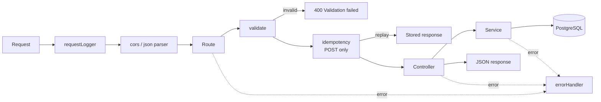
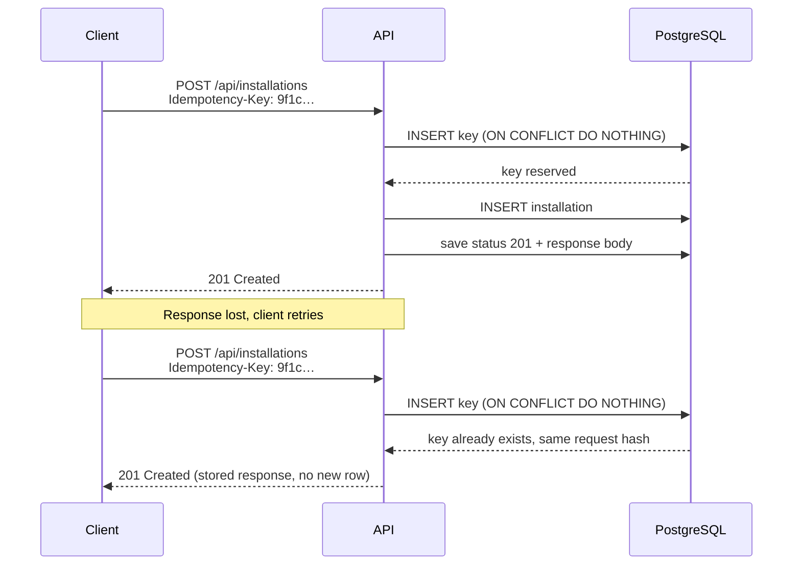

# Backend API

The backend is a Node.js REST API built with Express. It serves the React frontend, reads and writes PostgreSQL (hosted on Supabase), validates every request, makes create requests safe to retry, and logs every request.

## Stack

| Concern | Library | Purpose |
|---|---|---|
| HTTP server | `express` 5 | Routing and middleware. Errors thrown in `async` handlers reach the error handler automatically. |
| Database | `pg` | Connection pool and parameterised SQL (`$1`, `$2`), which prevents SQL injection. |
| Validation | `zod` | Schemas for request bodies, query strings and route parameters. |
| Logging | `pino`, `pino-http` | Structured logs and one log line per request. |
| Log formatting | `pino-pretty` | Coloured, readable logs in development only. |
| Configuration | `dotenv` | Loads `.env` locally. Azure App Settings provide the same variables in production. |
| Cross-origin requests | `cors` | Allows the frontend origin to call the API. |

## Folder structure

```
backend/
├── package.json
├── .env.example
├── certs/
│   └── supabase-ca.crt          downloaded from Supabase, not generated
├── scripts/
│   ├── runSqlFiles.js
│   ├── migrate.js
│   └── seed.js
└── src/
    ├── server.js
    ├── app.js
    ├── constants.js
    ├── config/
    │   ├── env.js
    │   └── database.js
    ├── routes/
    │   ├── index.js
    │   ├── siteRoutes.js
    │   └── installationRoutes.js
    ├── controllers/
    │   ├── healthController.js
    │   ├── siteController.js
    │   ├── installationController.js
    │   ├── summaryController.js
    │   └── userController.js
    ├── services/
    │   ├── siteService.js
    │   ├── installationService.js
    │   ├── summaryService.js
    │   ├── userService.js
    │   └── idempotencyService.js
    ├── validators/
    │   ├── commonSchemas.js
    │   ├── siteSchemas.js
    │   ├── installationSchemas.js
    │   └── userSchemas.js
    ├── middleware/
    │   ├── requestLogger.js
    │   ├── validate.js
    │   ├── idempotency.js
    │   ├── notFound.js
    │   └── errorHandler.js
    └── utils/
        ├── HttpError.js
        ├── logger.js
        ├── pagination.js
        └── sql.js
```

| Layer | Knows about | Does not know about |
|---|---|---|
| Routes | URLs, which middleware and controller to use | SQL, response formatting |
| Controllers | `req` and `res`, status codes | SQL |
| Services | SQL and business rules | HTTP |
| Middleware | Cross-cutting concerns: logging, validation, idempotency, errors | Business rules |

## Request lifecycle



## Conventions

| Convention | Rule |
|---|---|
| Base path | Every endpoint is under `/api` |
| Format | JSON request and response bodies |
| Field names | camelCase in JSON (`installedOn`), snake_case in SQL (`installed_on`). SQL aliases do the conversion, for example `installed_on AS "installedOn"`. |
| Dates | `DATE` columns are returned as `YYYY-MM-DD` strings. Timestamps are ISO 8601 in UTC. |
| Ids | Positive integers |
| Pagination | `page` starts at 1, `limit` defaults to 10 and is capped at 100 |
| Search | Case-insensitive partial match with `ILIKE`, always passed as a parameter |
| Sorting | `sortBy` must be one of the listed columns and `order` is `asc` or `desc`. Column names map to fixed SQL expressions, so user input never reaches the `ORDER BY` text. Ties are broken by id so pages never overlap. |

## Endpoints

| Method | Path | Description | Success |
|---|---|---|---|
| GET | `/api/health` | API and database status | 200 |
| GET | `/api/summary` | Dashboard totals, status breakdown, monthly counts, recent installations | 200 |
| GET | `/api/sites` | Paginated list of sites | 200 |
| GET | `/api/sites/:id` | One site | 200 |
| POST | `/api/sites` | Create a site | 201 |
| PUT | `/api/sites/:id` | Replace a site's details | 200 |
| DELETE | `/api/sites/:id` | Delete a site and its installations | 204 |
| GET | `/api/installations` | Paginated list of installations | 200 |
| GET | `/api/installations/:id` | One installation | 200 |
| POST | `/api/installations` | Create an installation | 201 |
| PUT | `/api/installations/:id` | Replace an installation's details | 200 |
| DELETE | `/api/installations/:id` | Delete an installation | 204 |
| GET | `/api/users` | List users, optionally filtered by role | 200 |

### GET /api/health

Runs `SELECT 1` against the database. Azure App Service uses it as the health check path. It is not written to the request log.

```json
{ "status": "ok", "database": "connected" }
```

If the database cannot be reached the response is `503`:

```json
{ "status": "error", "database": "unreachable" }
```

### GET /api/summary

Runs four aggregation queries in parallel. Each one matches a file in `database/queries/aggregations/`.

```json
{
  "totals": {
    "sites": 5,
    "activeSites": 4,
    "installations": 5,
    "completedInstallations": 3,
    "inProgressInstallations": 1,
    "pendingInstallations": 1
  },
  "statusBreakdown": [
    { "status": "completed", "count": 3 },
    { "status": "in_progress", "count": 1 },
    { "status": "pending", "count": 1 }
  ],
  "monthlyInstallations": [
    { "month": "2026-05", "label": "May", "count": 1 },
    { "month": "2026-06", "label": "Jun", "count": 1 }
  ],
  "recentInstallations": [
    {
      "id": 5,
      "equipment": "CCTV Array",
      "status": "pending",
      "installedOn": "2026-10-04",
      "siteId": 1,
      "siteName": "Chennai Plant",
      "technicianId": null,
      "technicianName": null
    }
  ]
}
```

| Field | Source |
|---|---|
| `totals` | `COUNT` and `COUNT ... FILTER` over `sites` and `installations` |
| `statusBreakdown` | `GROUP BY status` |
| `monthlyInstallations` | `generate_series` over the last six months with a `LEFT JOIN`, so months without installations return `0` |
| `recentInstallations` | The five latest installations joined to `sites` and `users` |

### GET /api/sites

| Query parameter | Type | Default | Rules |
|---|---|---|---|
| `page` | integer | `1` | 1 or more |
| `limit` | integer | `10` | 1 to 100 |
| `search` | string | | Matches site name or city |
| `status` | string | | `active` or `inactive` |
| `region` | string | | `North`, `South`, `East` or `West` |
| `sortBy` | string | `name` | `name`, `region`, `status` or `installationCount` |
| `order` | string | `asc` | `asc` or `desc` |

Example: `GET /api/sites?page=1&limit=10&search=pune&status=active&region=West&sortBy=installationCount&order=desc`

```json
{
  "data": [
    {
      "id": 3,
      "name": "Pune Warehouse",
      "city": "Pune",
      "region": "West",
      "status": "active",
      "installationCount": 14,
      "createdAt": "2026-10-07T09:12:00.000Z",
      "updatedAt": "2026-10-07T09:12:00.000Z"
    }
  ],
  "pagination": { "page": 1, "limit": 10, "total": 1, "totalPages": 1 }
}
```

`installationCount` comes from a `LEFT JOIN` with `COUNT`, so sites without installations return `0`. The page of rows and the total count run in parallel.

### GET /api/sites/:id

Returns one site in the same shape as a list item. Responds `404` with `Site not found` if the id does not exist.

### POST /api/sites

Headers: `Content-Type: application/json`, `Idempotency-Key: <uuid>` (see [Idempotency](#idempotency)).

```json
{ "name": "Surat Distribution Centre", "city": "Surat", "region": "West", "status": "active" }
```

| Field | Rules |
|---|---|
| `name` | Required, trimmed, 1 to 150 characters, unique |
| `city` | Required, trimmed, 1 to 100 characters |
| `region` | Required, one of `North`, `South`, `East`, `West` |
| `status` | Optional, `active` or `inactive`, defaults to `active` |

Responds `201` with the created site. Responds `409` if the name is already used.

### PUT /api/sites/:id

Same body and rules as `POST /api/sites`. Responds `200` with the updated site, `404` if the id does not exist, or `409` if the new name belongs to another site. The database trigger refreshes `updatedAt`.

### DELETE /api/sites/:id

Responds `204` with no body. The site's installations are deleted by `ON DELETE CASCADE`. Responds `404` if the id does not exist.

### GET /api/installations

| Query parameter | Type | Default | Rules |
|---|---|---|---|
| `page` | integer | `1` | 1 or more |
| `limit` | integer | `10` | 1 to 100 |
| `search` | string | | Matches equipment or technician name |
| `siteId` | integer | | An existing site id |
| `status` | string | | `pending`, `in_progress` or `completed` |
| `sortBy` | string | `installedOn` | `equipment`, `siteName`, `technicianName`, `installedOn` or `status` |
| `order` | string | `desc` | `asc` or `desc` |

Example: `GET /api/installations?page=1&limit=10&search=hvac&siteId=2&status=pending&sortBy=equipment&order=asc`

```json
{
  "data": [
    {
      "id": 41,
      "equipment": "HVAC Unit",
      "status": "pending",
      "installedOn": "2026-10-05",
      "siteId": 2,
      "siteName": "Bengaluru Data Centre",
      "technicianId": 3,
      "technicianName": "Anita Sharma",
      "createdAt": "2026-10-05T10:20:00.000Z",
      "updatedAt": "2026-10-05T10:20:00.000Z"
    }
  ],
  "pagination": { "page": 1, "limit": 10, "total": 1, "totalPages": 1 }
}
```

Rows are ordered by `installedOn` descending. `siteName` comes from an `INNER JOIN` on `sites`. `technicianName` comes from a `LEFT JOIN` on `users` and is `null` for unassigned installations.

### GET /api/installations/:id

Returns one installation in the same shape as a list item. Responds `404` with `Installation not found` if the id does not exist.

### POST /api/installations

Headers: `Content-Type: application/json`, `Idempotency-Key: <uuid>`.

```json
{
  "equipment": "HVAC Unit",
  "siteId": 2,
  "technicianId": 3,
  "installedOn": "2026-10-05",
  "status": "pending"
}
```

| Field | Rules |
|---|---|
| `equipment` | Required, trimmed, 1 to 150 characters |
| `siteId` | Required, positive integer, must reference an existing site |
| `technicianId` | Optional, positive integer or `null`, must reference an existing user |
| `installedOn` | Required, `YYYY-MM-DD` |
| `status` | Optional, `pending`, `in_progress` or `completed`, defaults to `pending` |

Responds `201` with the created installation including `siteName` and `technicianName`. Responds `400` if `siteId` or `technicianId` does not exist.

### PUT /api/installations/:id

Same body and rules as `POST /api/installations`. Responds `200` with the updated installation or `404` if the id does not exist.

### DELETE /api/installations/:id

Responds `204` with no body, or `404` if the id does not exist.

### GET /api/users

| Query parameter | Rules |
|---|---|
| `role` | Optional, `admin` or `technician` |

```json
[
  { "id": 2, "fullName": "Ravi Kumar", "email": "ravi.kumar@siteops.example", "role": "technician" }
]
```

The installation form uses `GET /api/users?role=technician` to fill the technician dropdown.

## Errors

Every error response has the same shape:

```json
{
  "message": "Validation failed",
  "errors": {
    "name": "Site name is required",
    "region": "Region must be North, South, East or West"
  }
}
```

`errors` is only present for validation failures. Its keys match the request field names, so the frontend shows each message under the matching form field.

| Situation | Status | Message |
|---|---|---|
| Body, query or route parameter fails validation | 400 | `Please fix the highlighted fields.` |
| Referenced site or user does not exist (PostgreSQL `23503`) | 400 | `The selected site or technician no longer exists.` |
| Record does not exist | 404 | `This site no longer exists.` / `This installation no longer exists.` |
| Unknown route | 404 | `Route not found.` |
| Duplicate site name (PostgreSQL `23505`) | 409 | `A site with this name already exists.` with `errors.name` set to the same text |
| Same `Idempotency-Key` still being processed | 409 | `This request is still being processed. Please wait a moment.` |
| Same `Idempotency-Key` sent with a different body | 422 | `This request was already submitted with different details.` |
| Database unreachable | 503 | `The service is temporarily unavailable. Please try again shortly.` |
| Anything else | 500 | `Something went wrong. Please try again.` |

Field messages in `errors` use the same wording as the frontend form checks, for example `Enter a site name.` and `Choose a region.`, so the user sees one consistent message whether the browser or the server catches the problem. The frontend's Zod schemas in `frontend/src/validation` mirror `src/validators`; when a rule or message changes, change both.

For `5xx` responses the frontend appends the first eight characters of the `X-Request-Id` header, for example `Something went wrong. Please try again. (Reference: b1e2c3d4)`. The `cors` middleware lists `X-Request-Id` in `exposedHeaders` so the browser can read it.

`errorHandler` is the only place that turns errors into responses. Services throw `HttpError` for expected cases such as not found. PostgreSQL error codes are mapped in one table. Stack traces and SQL details are logged and never sent to the client.

## Idempotency

### The problem

`GET`, `PUT` and `DELETE` are idempotent: sending the same request twice leaves the data in the same state as sending it once. `POST` is not. If a create request succeeds but the response is lost, for example on a slow network, a retry creates a second record.

| Request | Repeating it is safe | Reason |
|---|---|---|
| `GET` | Yes | Read only |
| `PUT /:id` | Yes | Writes the same values again |
| `DELETE /:id` | Yes | The second call returns `404` and the data is unchanged |
| `POST /sites` | Partly | The unique site name blocks a duplicate, but the retry gets a `409` even though the first request worked |
| `POST /installations` | No | Nothing unique to block a duplicate |

### The solution: the Idempotency-Key header

The client sends a unique key with every create request. The server stores the key with the response it produced. If the same key arrives again, the server returns the stored response instead of creating another record.



### Rules

| Case | Result |
|---|---|
| New key | The request runs normally. The status and body are stored with the key. |
| Same key, same request, finished | The stored status and body are returned. Nothing is written. Response header `Idempotent-Replayed: true`. |
| Same key, same request, still running | `409`. The client can retry shortly. |
| Same key, different method, path or body | `422`. A key belongs to exactly one request. |
| Request failed validation (`4xx`) | The key is released, so the corrected request can reuse it. |
| No header | The request runs without idempotency protection. |
| Key format | Must be a UUID. Anything else gets `400`. |
| Expiry | Keys older than 24 hours are deleted when a new key is stored. |

### Storage

Migration `006_create_idempotency_keys.sql` adds:

| Column | Type | Purpose |
|---|---|---|
| `key` | `UUID` | Primary key, the header value |
| `request_hash` | `CHAR(64)` | SHA-256 of method, path and body, used to detect reuse with a different request |
| `status_code` | `SMALLINT` | Stored response status, `NULL` while the request is running |
| `response_body` | `JSONB` | Stored response body |
| `created_at` | `TIMESTAMPTZ` | Used for the 24-hour expiry |

The key is reserved with `INSERT ... ON CONFLICT (key) DO NOTHING`. Only one of two simultaneous requests with the same key can reserve it, so duplicates cannot slip through even under concurrency.

### Where it applies

The `idempotency` middleware is attached to `POST /api/sites` and `POST /api/installations`. The frontend generates the key with `crypto.randomUUID()` when a form opens and sends the same key for every submit of that form, so a retried submit is recognised as the same request.

### Database scripts

The migration and seed scripts are also safe to run repeatedly:

| Script | Why it is safe |
|---|---|
| Migrations | `CREATE TABLE IF NOT EXISTS`, `CREATE INDEX IF NOT EXISTS`, `CREATE OR REPLACE FUNCTION` and `CREATE OR REPLACE TRIGGER` |
| Seeds | `000_reset.sql` empties the tables and restarts the ids first, so every run produces the same data |

## Logging

### Libraries

| Package | Environment | Role |
|---|---|---|
| `pino` | All | Logger. Writes one JSON object per line. |
| `pino-http` | All | Middleware that logs each request when the response finishes |
| `pino-pretty` | Development only | Formats the JSON as coloured, readable lines |

### Development output

```
14:02:11 INFO  Server listening on port 5000
14:02:11 INFO  Database connected
14:02:15 INFO  GET /api/sites?page=1&limit=10 200 - 18ms
14:02:16 INFO  POST /api/sites 201 - 34ms
14:02:17 INFO  POST /api/sites 201 - 3ms (idempotent replay)
14:02:19 WARN  POST /api/sites 400 - 4ms
               errors: { "name": "Site name is required" }
14:02:22 WARN  GET /api/sites/999 404 - 6ms
14:02:30 ERROR GET /api/summary 500 - 12ms
               Error: connect ECONNREFUSED 127.0.0.1:5432
                   at TCPConnectWrap.afterConnect ...
```

### Levels and colours

| Level | Colour | Used for |
|---|---|---|
| `debug` | Blue | SQL timings, off unless `LOG_LEVEL=debug` |
| `info` | Green | Startup messages and `2xx` / `3xx` responses |
| `warn` | Yellow | `4xx` responses: validation, not found, conflicts |
| `error` | Red | `5xx` responses, with the stack trace |
| `fatal` | White on red | The server cannot start, for example missing configuration |

### Production output

In production the colours and formatting are turned off. Each line is JSON so Azure App Service log streaming and Log Analytics can filter by any field.

```json
{"level":"info","time":"2026-10-07T08:32:15.120Z","reqId":"b1e2c3d4-…","req":{"method":"GET","url":"/api/sites?page=1"},"res":{"statusCode":200},"responseTime":18,"msg":"GET /api/sites?page=1 200"}
```

### Configuration

| Setting | Value | Purpose |
|---|---|---|
| Level | `LOG_LEVEL`, default `info` | Controls how much is logged |
| Level per response | `5xx` → `error`, `4xx` → `warn`, otherwise `info` | Problems stand out by colour and level |
| Message | `"<METHOD> <URL> <STATUS>"` | One readable line per request |
| Request id | A UUID per request, returned in the `X-Request-Id` response header | Links a user's error report to the exact log line |
| Ignored path | `/api/health` | Azure calls it every minute and it adds no information |
| Redaction | `authorization` and `cookie` headers, the database password | Secrets never reach the logs |
| Pretty print | `pino-pretty` with `colorize`, time as `HH:MM:ss`, `pid` and `hostname` hidden | Only when `NODE_ENV=development` |

## Database connection (Supabase)

The database is PostgreSQL hosted on Supabase. The backend connects with `pg` and plain SQL, not the `supabase-js` client, so every join and aggregation is visible in the services.

### Connection string

Supabase offers three connection strings under **Connect** in the project dashboard.

| Mode | Host | Port | IPv4 | Use |
|---|---|---|---|---|
| Direct | `db.<project-ref>.supabase.co` | 5432 | No, IPv6 only without the paid add-on | Local tools on IPv6 networks |
| Session pooler | `aws-0-<region>.pooler.supabase.com` | 5432 | Yes | This backend: a long-running server on Azure App Service |
| Transaction pooler | `aws-0-<region>.pooler.supabase.com` | 6543 | Yes | Serverless functions |

The backend uses the session pooler because Azure App Service connects over IPv4 and keeps one long-running process. The pooler username includes the project reference:

```
postgresql://postgres.<project-ref>:<password>@aws-0-<region>.pooler.supabase.com:5432/postgres
```

### SSL

Supabase only accepts encrypted connections. The backend verifies the server certificate with Supabase's CA certificate, downloaded from **Database Settings → SSL Configuration** and stored at `backend/certs/supabase-ca.crt`. Verifying the certificate protects against a server impersonating the database.

### Pool

| Setting | Value | Reason |
|---|---|---|
| `max` | 10 | Stays within the free tier's connection limit |
| `idleTimeoutMillis` | 30000 | Releases unused connections |
| `connectionTimeoutMillis` | 5000 | Fails fast when the database is unreachable |

### Row Level Security

Supabase exposes every table in the `public` schema through its automatic REST API, reachable with the project's public `anon` key. Without protection, anyone with that key could read or change the tables directly and bypass this API.

Migration `007_enable_row_level_security.sql` turns on Row Level Security for every table and adds no policies, so the automatic REST API returns nothing. The backend connects as the table owner, which is not subject to Row Level Security, so it keeps full access.

### Supabase notes

| Topic | Detail |
|---|---|
| Version | PostgreSQL 15 or later, which supports `CREATE OR REPLACE TRIGGER` |
| Region | Choose the region closest to the Azure App Service region, for example `ap-south-1` (Mumbai) with Azure Central India |
| Free tier | Projects pause after seven days without activity. Restore the project from the dashboard before a review. |
| Migrations | `npm run db:migrate` with the pooler `DATABASE_URL`, or paste the files into the Supabase SQL Editor in order |

## Configuration

`backend/.env.example`:

```
NODE_ENV=development
PORT=5000
DATABASE_URL=postgresql://postgres.<project-ref>:<password>@aws-0-<region>.pooler.supabase.com:5432/postgres
DATABASE_SSL_CA=certs/supabase-ca.crt
CORS_ORIGIN=http://localhost:5173
LOG_LEVEL=info
```

| Variable | Required | Description |
|---|---|---|
| `NODE_ENV` | No | `development` turns on pretty logs. Defaults to `production`. |
| `PORT` | No | Defaults to `5000`. Azure App Service sets it automatically. |
| `DATABASE_URL` | Yes | Supabase session pooler connection string |
| `DATABASE_SSL_CA` | Yes | Path to the Supabase CA certificate |
| `CORS_ORIGIN` | Yes | Frontend origin, for example the Azure Static Web Apps URL |
| `LOG_LEVEL` | No | `debug`, `info`, `warn` or `error`. Defaults to `info`. |

`config/env.js` validates these variables with `zod` at startup. A missing or invalid value stops the server with a `fatal` log that names the variable.

On Azure App Service the same variables are set as Application Settings. `.env` is listed in `.gitignore` and never committed.

## Scripts

| Command | Description |
|---|---|
| `npm run dev` | Starts the API with `node --watch` and pretty logs |
| `npm start` | Starts the API for production |
| `npm run db:migrate` | Runs `database/migrations/*.sql` in filename order |
| `npm run db:seed` | Runs `database/seeds/*.sql` in filename order |
