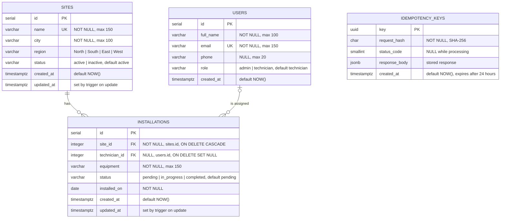
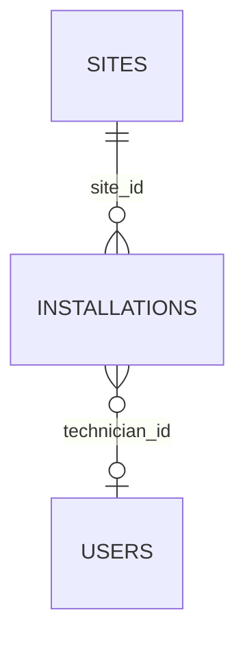

# Database

The Site Operations Dashboard stores its data in PostgreSQL. Three normalized tables hold the business data: `users`, `sites` and `installations`. A fourth table, `idempotency_keys`, supports the API and has no relationships.

## Entity relationship diagram



The same diagram in plain text:

```
┌─────────────────────────────┐           ┌────────────────────────────────┐           ┌─────────────────────────────┐
│ sites                       │           │ installations                  │           │ users                       │
├─────────────────────────────┤           ├────────────────────────────────┤           ├─────────────────────────────┤
│ PK id          serial       │ 1       * │ PK id             serial       │           │ PK id          serial       │
│ UQ name        varchar(150) ├───────────┤ FK site_id        integer      │ *    0..1 │    full_name   varchar(100) │
│    city        varchar(100) │           │ FK technician_id  integer      ├───────────┤ UQ email       varchar(150) │
│    region      varchar(10)  │           │    equipment      varchar(150) │           │    phone       varchar(20)  │
│    status      varchar(10)  │           │    status         varchar(20)  │           │    role        varchar(20)  │
│    created_at  timestamptz  │           │    installed_on   date         │           │    created_at  timestamptz  │
│    updated_at  timestamptz  │           │    created_at     timestamptz  │           └─────────────────────────────┘
└─────────────────────────────┘           │    updated_at     timestamptz  │
                                          └────────────────────────────────┘

┌───────────────────────────────┐
│ idempotency_keys              │
├───────────────────────────────┤
│ PK key            uuid        │
│    request_hash   char(64)    │
│    status_code    smallint    │
│    response_body  jsonb       │
│    created_at     timestamptz │
└───────────────────────────────┘
```

| Notation | Meaning |
|---|---|
| `PK` | Primary key |
| `FK` | Foreign key |
| `UQ` | Unique |
| `1` / `*` | Exactly one / zero or more |
| `0..1` | Zero or one |
| `\|\|--o{` | Mermaid: exactly one to zero or more |
| `\|o--o{` | Mermaid: zero or one to zero or more |

## Relationships

| Type | Tables | Implemented by | Meaning |
|---|---|---|---|
| One-to-many | `sites` → `installations` | `installations.site_id` (`NOT NULL`) | A site has zero or more installations. Every installation belongs to exactly one site. |
| One-to-many | `users` → `installations` | `installations.technician_id` (nullable) | A technician is assigned zero or more installations. An installation has zero or one technician. |
| Many-to-many | `sites` ↔ `users` | `installations` as the associative table | A technician works at many sites, and a site is served by many technicians. Each link also records the equipment, status and date. |
| One-to-one | — | — | Not used. No entity belongs to exactly one other entity, so a one-to-one table would add a join with no benefit. |

The many-to-many relationship between sites and technicians, resolved by `installations`:



### Delete behaviour

| Action | Rule | Reason |
|---|---|---|
| Delete a site | `ON DELETE CASCADE` removes its installations | An installation cannot exist without its site. |
| Delete a user | `ON DELETE SET NULL` keeps the installations as unassigned | Installation history is kept when a technician leaves. |

## Tables

### `sites`

| Column | Type | Rules |
|---|---|---|
| `id` | `SERIAL` | Primary key |
| `name` | `VARCHAR(150)` | Required, unique |
| `city` | `VARCHAR(100)` | Required |
| `region` | `VARCHAR(10)` | `North`, `South`, `East` or `West` |
| `status` | `VARCHAR(10)` | `active` or `inactive`, defaults to `active` |
| `created_at` | `TIMESTAMPTZ` | Defaults to `NOW()` |
| `updated_at` | `TIMESTAMPTZ` | Refreshed on every update by a trigger |

### `installations`

| Column | Type | Rules |
|---|---|---|
| `id` | `SERIAL` | Primary key |
| `site_id` | `INTEGER` | Required, references `sites.id`, deleted with the site |
| `technician_id` | `INTEGER` | Optional, references `users.id`, set to `NULL` when the user is deleted |
| `equipment` | `VARCHAR(150)` | Required |
| `status` | `VARCHAR(20)` | `pending`, `in_progress` or `completed`, defaults to `pending` |
| `installed_on` | `DATE` | Required |
| `created_at` | `TIMESTAMPTZ` | Defaults to `NOW()` |
| `updated_at` | `TIMESTAMPTZ` | Refreshed on every update by a trigger |

### `users`

| Column | Type | Rules |
|---|---|---|
| `id` | `SERIAL` | Primary key |
| `full_name` | `VARCHAR(100)` | Required |
| `email` | `VARCHAR(150)` | Required, unique |
| `phone` | `VARCHAR(20)` | Optional; digits, spaces, `+` and `-`, checked by the API |
| `role` | `VARCHAR(20)` | `admin` or `technician`, defaults to `technician` |
| `created_at` | `TIMESTAMPTZ` | Defaults to `NOW()` |

### `idempotency_keys`

| Column | Type | Rules |
|---|---|---|
| `key` | `UUID` | Primary key, the `Idempotency-Key` header value |
| `request_hash` | `CHAR(64)` | Required, SHA-256 of the method, path and body |
| `status_code` | `SMALLINT` | `NULL` while the request runs, then the response status |
| `response_body` | `JSONB` | The stored response returned on a retry |
| `created_at` | `TIMESTAMPTZ` | Defaults to `NOW()`; rows older than 24 hours are deleted |

### Constraints and indexes

| Name | Table | Type | Purpose |
|---|---|---|---|
| `sites_name_key` | `sites` | Unique | No two sites share a name |
| `users_email_key` | `users` | Unique | No two users share an email |
| `installations_site_id_fkey` | `installations` | Foreign key | Links each installation to its site |
| `installations_technician_id_fkey` | `installations` | Foreign key | Links each installation to its technician |
| `CHECK` constraints | all tables | Check | Restrict `region`, `status` and `role` to their allowed values |
| `idx_installations_site_id_installed_on` | `installations` | Index | One site's installations, newest first |
| `idx_installations_installed_on` | `installations` | Index | Latest installations and date ranges |
| `idx_installations_status` | `installations` | Index | Status filter |
| `idx_installations_technician_id` | `installations` | Index | Joins to `users` |
| `idx_sites_status`, `idx_sites_region` | `sites` | Index | Status and region filters |
| `sites_set_updated_at`, `installations_set_updated_at` | `sites`, `installations` | Trigger | Refresh `updated_at` on every update |

## Normalization

The schema is in third normal form.

| Form | How the schema meets it |
|---|---|
| 1NF | Every column holds a single value. There are no lists or repeating groups. |
| 2NF | Every table has a single-column primary key, so no column depends on part of a key. |
| 3NF | Site and technician details live only in their own tables. `installations` stores their ids, not copies of their names, cities or emails. |

Region and status values are a short, fixed list, so they are enforced with `CHECK` constraints instead of lookup tables.

## Folder structure

```
database/
├── migrations/
│   ├── 001_create_users.sql
│   ├── 002_create_sites.sql
│   ├── 003_create_installations.sql
│   ├── 004_create_updated_at_trigger.sql
│   ├── 005_create_foreign_key_indexes.sql
│   ├── 006_create_idempotency_keys.sql
│   ├── 007_enable_row_level_security.sql
│   ├── 008_create_query_indexes.sql
│   └── 009_add_user_phone.sql
├── seeds/
│   ├── 000_reset.sql
│   ├── 001_users.sql
│   ├── 002_sites.sql
│   └── 003_installations.sql
└── queries/
    ├── joins/
    │   ├── installation_details.sql
    │   └── technician_sites.sql
    └── aggregations/
        ├── dashboard_totals.sql
        ├── installations_per_site.sql
        ├── status_breakdown.sql
        ├── monthly_installations.sql
        ├── completion_rate_by_region.sql
        └── technician_workload.sql
```

- **Migrations** create the schema. They are numbered so they run in order, and use `IF NOT EXISTS` / `CREATE OR REPLACE` so they can be run again safely.
- **Seeds** load a small, hand-written sample: 5 users (1 admin, 4 technicians), 5 sites (one inactive, one with no installations) and 5 installations across all three statuses, spread over the last five months, with one unassigned. Installations refer to sites by name and to technicians by email, not by id. `000_reset.sql` empties the tables first.
- **Queries** are standalone examples of joins and aggregations to run by hand. Each file holds one query and is named after what it returns. The SQL the application runs lives in `backend/src/services`; where an example matches an API query, it uses the same structure and column names in snake_case, while the API returns them in camelCase.

`007_enable_row_level_security.sql` turns on Row Level Security for every table. Supabase exposes tables through its automatic REST API; with Row Level Security on and no policies, that API returns nothing, while the backend, which connects as the table owner, keeps full access. On a local PostgreSQL server it has no visible effect.

## Queries

| File | Demonstrates | Returns |
|---|---|---|
| `joins/installation_details.sql` | `INNER JOIN` + `LEFT JOIN` across all three tables | The ten latest installations with site and technician names |
| `joins/technician_sites.sql` | The many-to-many relationship, `STRING_AGG` | Each technician with the sites they have worked at |
| `aggregations/dashboard_totals.sql` | `WITH` (common table expressions), `COUNT ... FILTER`, `CROSS JOIN` | Site and installation totals for the summary cards |
| `aggregations/installations_per_site.sql` | `LEFT JOIN` + `GROUP BY` | Installation count per site, including sites with none |
| `aggregations/status_breakdown.sql` | Window function `SUM(...) OVER ()` | Installations per status with a percentage |
| `aggregations/monthly_installations.sql` | `generate_series`, `LEFT JOIN` on a date range | Installations per month for the last six months, including empty months |
| `aggregations/completion_rate_by_region.sql` | `FILTER`, `NULLIF` | Completion rate per region |
| `aggregations/technician_workload.sql` | `LEFT JOIN` + conditional count | Total and open jobs per technician |

## Query optimization

### Techniques used

| Technique | Where | Effect |
|---|---|---|
| Indexes on filtered and sorted columns | `005`, `008` migrations | PostgreSQL finds matching rows without reading the whole table |
| Aggregation in SQL | Summary queries | `COUNT`, `FILTER` and `GROUP BY` return a handful of numbers instead of every row |
| Joins instead of one query per row | Installation and site lists | Site and technician names arrive in the same query as the installations |
| Pagination in SQL | List queries | `LIMIT` and `OFFSET` send one page, not the whole table |
| Filtering in SQL | List queries | Search and filters are `WHERE` conditions, not done in the browser |
| Named columns | All queries | Only the columns the API needs are read and sent |
| Parallel queries | Lists and summary | The page and its total count, and the four summary queries, run at the same time |
| Range conditions on raw columns | Monthly installations | `installed_on >= start AND installed_on < next_month` can use an index; `DATE_TRUNC('month', installed_on) = month` cannot |
| Connection pooling | Backend `pg.Pool` and the Supabase session pooler | Connections are reused instead of opened for every request |
| Parameterized queries | All backend queries | Values travel as `$1`, `$2`, which prevents SQL injection and lets PostgreSQL reuse query plans |

### Indexes

| Index | Columns | Serves |
|---|---|---|
| `idx_installations_site_id_installed_on` | `site_id, installed_on DESC` | Installations of one site, newest first; the per-site installation count |
| `idx_installations_installed_on` | `installed_on DESC, id DESC` | The installations list and recent installations, ordered newest first; the monthly date ranges |
| `idx_installations_status` | `status` | The installation status filter |
| `idx_installations_technician_id` | `technician_id` | Joins from installations to users |
| `idx_sites_status` | `status` | The site status filter |
| `idx_sites_region` | `region` | The site region filter |
| `sites_name_key` | `name` | Created by the `UNIQUE` constraint; also serves `ORDER BY name` on the sites list |

`008_create_query_indexes.sql` removes the single-column `idx_installations_site_id` from migration `005`: an index on `(site_id, installed_on)` also serves lookups by `site_id` alone, so keeping both would only slow down writes.

### Not indexed

| Query | Reason |
|---|---|
| Summary totals | They count every row, so the whole table is read regardless of indexes |
| Search with `ILIKE '%text%'` | A normal index only matches from the start of a value. A trigram index (`pg_trgm`) would be needed and is not worth the extension at this data size |
| `users.role` | The table is tiny; PostgreSQL reads it directly |

Indexes speed up reads but every insert and update must also maintain them, so only columns the application filters, sorts or joins on are indexed. On very small tables PostgreSQL may still choose to read the whole table, because that is cheaper than using an index; the indexes take effect as the data grows.

## SQL conventions

- Keywords in upper case, table and column names in `snake_case`
- One clause per line: `SELECT`, `FROM`, `JOIN`, `WHERE`, `GROUP BY`, `ORDER BY`
- Short, consistent aliases: `s` for sites, `i` for installations, `u` for users
- Columns listed by name; no `SELECT *`
- Multi-step queries split into named `WITH` parts instead of nested subqueries
- Constraints on their own indented line under the column they protect
- Seed data refers to related rows by natural keys such as site name and email, not by id
- One statement or one object per file, with the file named after what it creates or returns
- Values from users always passed as parameters, never concatenated into SQL

## Local setup

Requires PostgreSQL 14 or later.

### 1. Create the database

With a local PostgreSQL server:

```bash
psql -U postgres -c "CREATE DATABASE site_operations;"
```

With Supabase, the project's `postgres` database is used as is.

### 2. Point the backend at it

In `backend/.env`:

```
DATABASE_URL=postgresql://postgres:<password>@localhost:5432/site_operations
DATABASE_SSL=false
```

For Supabase use the session pooler connection string, `DATABASE_SSL=true` and `DATABASE_SSL_CA=certs/supabase-ca.crt`.

### 3. Create the tables and load sample data

From the `backend` folder:

```bash
npm run db:migrate
npm run db:seed
```

Each script prints one line per file it runs and stops at the first error. `db:migrate` is safe to run again. `db:seed` empties the tables and reloads the sample data every time.

### 4. Run a query

```bash
psql "postgresql://postgres:<password>@localhost:5432/site_operations" -f ../database/queries/aggregations/status_breakdown.sql
```

Any file in `database/queries` can be run the same way, or pasted into pgAdmin or the Supabase SQL Editor.
