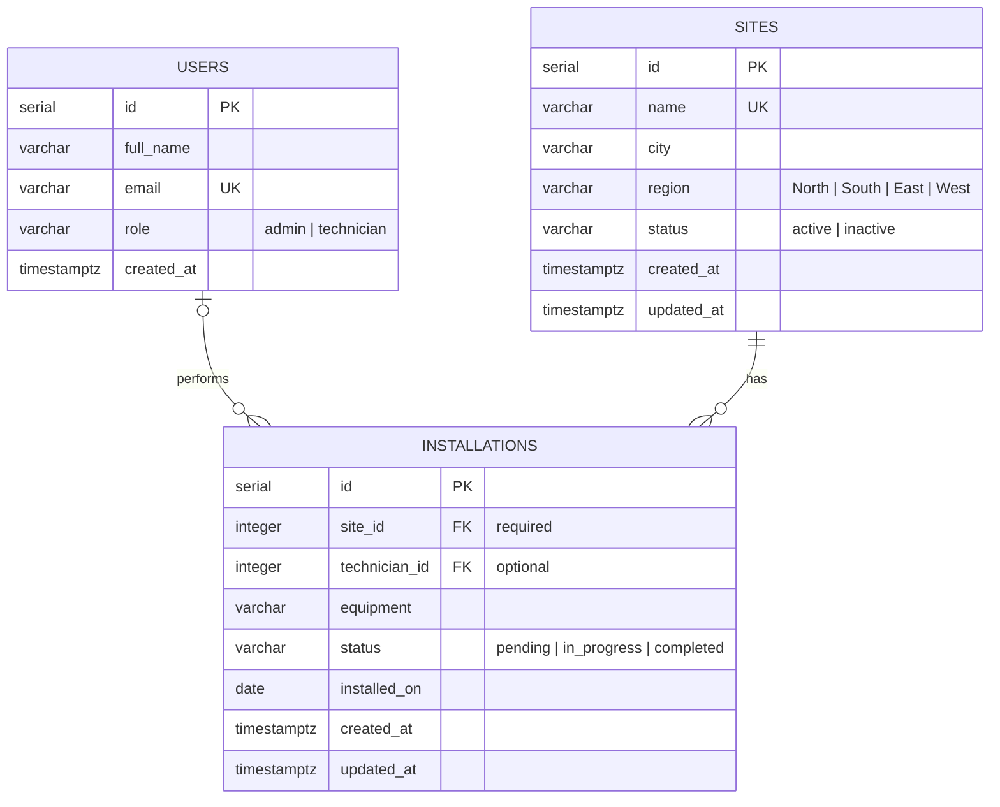
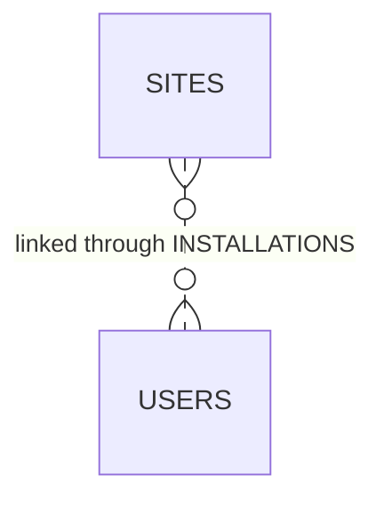

# Database

The Site Operations Dashboard stores its data in PostgreSQL across three normalized tables: `users`, `sites` and `installations`.

## Entity relationship diagram



## Relationships

| Type | Tables | Implemented by | Meaning |
|---|---|---|---|
| One-to-many | `sites` → `installations` | `installations.site_id` (`NOT NULL`) | A site has many installations. Every installation belongs to exactly one site. |
| One-to-many | `users` → `installations` | `installations.technician_id` (nullable) | A technician performs many installations. An installation has zero or one technician. |
| Many-to-many | `sites` ↔ `users` | `installations` as the associative table | A technician works at many sites, and a site is served by many technicians. Each link also records the equipment, status and date. |
| One-to-one | — | — | Not used. The data has no entity that belongs to exactly one other entity, so a one-to-one table would add a join with no benefit. |

The many-to-many relationship between sites and technicians, resolved by `installations`:



### Delete behaviour

| Action | Rule | Reason |
|---|---|---|
| Delete a site | `ON DELETE CASCADE` removes its installations | An installation cannot exist without its site. |
| Delete a user | `ON DELETE SET NULL` keeps the installations as unassigned | Installation history is kept when a technician leaves. |

## Tables

### `users`

| Column | Type | Rules |
|---|---|---|
| `id` | `SERIAL` | Primary key |
| `full_name` | `VARCHAR(100)` | Required |
| `email` | `VARCHAR(150)` | Required, unique |
| `role` | `VARCHAR(20)` | `admin` or `technician`, defaults to `technician` |
| `created_at` | `TIMESTAMPTZ` | Defaults to `NOW()` |

### `sites`

| Column | Type | Rules |
|---|---|---|
| `id` | `SERIAL` | Primary key |
| `name` | `VARCHAR(150)` | Required, unique |
| `city` | `VARCHAR(100)` | Required |
| `region` | `VARCHAR(10)` | `North`, `South`, `East` or `West` |
| `status` | `VARCHAR(10)` | `active` or `inactive`, defaults to `active` |
| `created_at` | `TIMESTAMPTZ` | Defaults to `NOW()` |
| `updated_at` | `TIMESTAMPTZ` | Refreshed on every update by a trigger |

### `installations`

| Column | Type | Rules |
|---|---|---|
| `id` | `SERIAL` | Primary key |
| `site_id` | `INTEGER` | Required, references `sites.id` |
| `technician_id` | `INTEGER` | Optional, references `users.id` |
| `equipment` | `VARCHAR(150)` | Required |
| `status` | `VARCHAR(20)` | `pending`, `in_progress` or `completed`, defaults to `pending` |
| `installed_on` | `DATE` | Required |
| `created_at` | `TIMESTAMPTZ` | Defaults to `NOW()` |
| `updated_at` | `TIMESTAMPTZ` | Refreshed on every update by a trigger |

## Normalization

The schema is in third normal form.

| Form | How the schema meets it |
|---|---|
| 1NF | Every column holds a single value. There are no lists or repeating groups. |
| 2NF | Every table has a single-column primary key, so no column depends on part of a key. |
| 3NF | Site and technician details live only in their own tables. `installations` stores their ids, not copies of their names, cities or emails. |

Region and status values are a short, fixed list, so they are enforced with `CHECK` constraints instead of lookup tables.

## Folder structure

```
database/
├── migrations/
│   ├── 001_create_users.sql
│   ├── 002_create_sites.sql
│   ├── 003_create_installations.sql
│   ├── 004_create_updated_at_trigger.sql
│   ├── 005_create_foreign_key_indexes.sql
│   ├── 006_create_idempotency_keys.sql
│   └── 007_enable_row_level_security.sql
├── seeds/
│   ├── 000_reset.sql
│   ├── 001_users.sql
│   ├── 002_sites.sql
│   └── 003_installations.sql
└── queries/
    ├── joins/
    │   ├── installation_details.sql
    │   └── technician_sites.sql
    └── aggregations/
        ├── dashboard_totals.sql
        ├── installations_per_site.sql
        ├── status_breakdown.sql
        ├── monthly_installations.sql
        ├── completion_rate_by_region.sql
        └── technician_workload.sql
```

- **Migrations** create the schema. They are numbered so they run in order, and use `IF NOT EXISTS` / `CREATE OR REPLACE` so they can be run again safely.
- **Seeds** load sample data: 6 users, 12 sites and 112 installations spread over the last five months. `000_reset.sql` empties the tables first.
- **Queries** demonstrate joins and aggregations. Each file holds one query and is named after what it returns.

PostgreSQL does not index foreign keys automatically, so `005_create_foreign_key_indexes.sql` adds indexes on `installations.site_id` and `installations.technician_id`, which every join uses.

`006_create_idempotency_keys.sql` stores the responses of create requests so a retried request is not saved twice. See the Idempotency section of [backend.md](backend.md).

`007_enable_row_level_security.sql` turns on Row Level Security for every table. Supabase exposes tables through its automatic REST API; with Row Level Security on and no policies, that API returns nothing, while the backend, which connects as the table owner, keeps full access.

The migrations and seeds can be run with `npm run db:migrate` and `npm run db:seed` from the `backend` folder.

## Queries

| File | Demonstrates | Returns |
|---|---|---|
| `joins/installation_details.sql` | `INNER JOIN` + `LEFT JOIN` across all three tables | The ten latest installations with site and technician names |
| `joins/technician_sites.sql` | The many-to-many relationship, `STRING_AGG` | Each technician with the sites they have worked at |
| `aggregations/dashboard_totals.sql` | `COUNT`, `COUNT ... FILTER`, subqueries | Site and installation totals for the summary cards |
| `aggregations/installations_per_site.sql` | `LEFT JOIN` + `GROUP BY` | Installation count per site, including sites with none |
| `aggregations/status_breakdown.sql` | Window function `SUM(...) OVER ()` | Installations per status with a percentage |
| `aggregations/monthly_installations.sql` | `generate_series` + `LEFT JOIN` | Installations per month for the last six months, including empty months |
| `aggregations/completion_rate_by_region.sql` | `FILTER`, `NULLIF` | Completion rate per region |
| `aggregations/technician_workload.sql` | `LEFT JOIN` + conditional count | Total and open jobs per technician |

## Running the scripts

Requires PostgreSQL 14 or later (`CREATE OR REPLACE TRIGGER`). Set `DATABASE_URL` to the target database, then run the migrations and seeds in order.

PowerShell:

```powershell
Get-ChildItem database/migrations/*.sql | Sort-Object Name | ForEach-Object { psql $env:DATABASE_URL -v ON_ERROR_STOP=1 -f $_.FullName }
Get-ChildItem database/seeds/*.sql | Sort-Object Name | ForEach-Object { psql $env:DATABASE_URL -v ON_ERROR_STOP=1 -f $_.FullName }
```

Bash:

```bash
for file in database/migrations/*.sql database/seeds/*.sql; do
  psql "$DATABASE_URL" -v ON_ERROR_STOP=1 -f "$file"
done
```

Run any query file the same way:

```bash
psql "$DATABASE_URL" -f database/queries/aggregations/status_breakdown.sql
```
