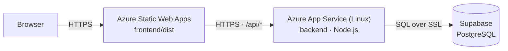

# Deployment

The Site Operations Dashboard is deployed to Microsoft Azure with the Azure CLI. The frontend runs on Azure Static Web Apps, the backend on Azure App Service, and the database stays on Supabase.



| Part | Azure service | Source |
|---|---|---|
| Frontend | Static Web Apps | `frontend/dist`, built locally |
| Backend | App Service, Linux, Node.js | `backend`, uploaded as a zip |
| Database | Not on Azure; Supabase | Created with `npm run db:migrate` |

All commands below are for Windows PowerShell and are run from the project root unless stated otherwise.

## Prerequisites

| Requirement | Details |
|---|---|
| Azure subscription | A free account, Azure for Students, or pay-as-you-go |
| Azure CLI | `winget install --exact --id Microsoft.AzureCLI`, then open a new terminal and check with `az version` |
| Node.js | 20.11 or later |
| Supabase project | Session pooler connection string in `backend/.env` and the CA certificate saved as `backend/certs/supabase-ca.crt` (see [Local project setup](../README.md#local-project-setup)) |

## 1. Sign in

```powershell
az login
az account show --output table
```

`az login` opens a Microsoft sign-in window. If you have more than one subscription, choose one:

```powershell
az account set --subscription "<subscription name or id>"
```

## 2. Set the deployment variables

Every later command uses these variables. App Service names must be unique across Azure, so replace `<your-name>`.

```powershell
$resourceGroup = "rg-siteops"
$location = "centralindia"
$plan = "plan-siteops"
$api = "siteops-api-<your-name>"
$web = "siteops-web-<your-name>"
$webLocation = "eastasia"
$sku = "B1"
```

| Variable | Meaning |
|---|---|
| `$resourceGroup` | The group that holds every resource of this project |
| `$location` | Region for the backend; Central India is closest to the sample data |
| `$plan` | The App Service plan, the server the backend runs on |
| `$api` | The backend app; becomes `https://<name>.azurewebsites.net` |
| `$web` | The frontend app |
| `$webLocation` | Static Web Apps is offered in a few regions only; East Asia is the closest to India |
| `$sku` | App Service tier: `B1` or `F1` (see [Cost](#cost)) |

## 3. Create the resources

**Resource group**

```powershell
az group create --name $resourceGroup --location $location
```

**Backend: App Service plan and web app**

Check the Node.js runtimes available for Linux and use the newest LTS version listed:

```powershell
az webapp list-runtimes --os-type linux --output table
```

```powershell
az appservice plan create --name $plan --resource-group $resourceGroup --location $location --is-linux --sku $sku
az webapp create --name $api --resource-group $resourceGroup --plan $plan --runtime "NODE:22-lts"
```

**Frontend: Static Web App**

```powershell
az staticwebapp create --name $web --resource-group $resourceGroup --location $webLocation --sku Free
```

**Read both URLs**

```powershell
$apiUrl = "https://" + (az webapp show --name $api --resource-group $resourceGroup --query defaultHostName --output tsv)
$webUrl = "https://" + (az staticwebapp show --name $web --resource-group $resourceGroup --query defaultHostname --output tsv)
$apiUrl
$webUrl
```

Both apps are created before either is configured because each needs the other's address: the backend allows the frontend URL through CORS, and the frontend is built with the backend URL.

## 4. Configure the backend

**Environment variables**

The connection string is read from `backend/.env` so it never appears in the terminal history.

```powershell
$databaseUrl = (Select-String -Path backend/.env -Pattern '^DATABASE_URL=(.+)$').Matches[0].Groups[1].Value

az webapp config appsettings set --name $api --resource-group $resourceGroup --output none --settings `
  NODE_ENV=production `
  DATABASE_URL="$databaseUrl" `
  DATABASE_SSL=true `
  DATABASE_SSL_CA=certs/supabase-ca.crt `
  CORS_ORIGIN="$webUrl" `
  LOG_LEVEL=info `
  SCM_DO_BUILD_DURING_DEPLOYMENT=true
```

| Setting | Purpose |
|---|---|
| `NODE_ENV=production` | JSON logs instead of coloured development logs |
| `DATABASE_URL` | Supabase session pooler connection string |
| `DATABASE_SSL`, `DATABASE_SSL_CA` | Encrypted connection verified with the Supabase certificate |
| `CORS_ORIGIN` | Only the deployed frontend may call the API |
| `LOG_LEVEL` | Amount of logging |
| `SCM_DO_BUILD_DURING_DEPLOYMENT=true` | Azure runs `npm install` after each upload, so `node_modules` is not uploaded |

App Service sets `PORT` itself, and the backend reads it.

**Startup command, health check and logs**

```powershell
az webapp config set --name $api --resource-group $resourceGroup --output none `
  --startup-file "npm start" `
  --generic-configurations "healthCheckPath=/api/health"

az webapp log config --name $api --resource-group $resourceGroup --output none `
  --application-logging filesystem --level information
```

| Setting | Purpose |
|---|---|
| Startup command | Starts the API with `npm start` |
| Health check | Azure calls `/api/health` and restarts the app if it stops answering |
| Application logging | Makes the backend's logs available to `az webapp log tail` |

## 5. Prepare the database

Create the tables and sample data in Supabase once. `backend/.env` must contain the Supabase connection string.

```powershell
cd backend
npm run db:migrate
npm run db:seed
cd ..
```

Run `npm run db:migrate` again after adding a migration. Do not run `npm run db:seed` against a database with real data: it empties the tables first.

## 6. Deploy the backend

```powershell
Compress-Archive -Path backend/src, backend/certs, backend/package.json, backend/package-lock.json -DestinationPath backend.zip -Force
az webapp deploy --name $api --resource-group $resourceGroup --src-path backend.zip --type zip
Remove-Item backend.zip
```

The zip contains only what the server needs. `node_modules` and `.env` are left out; Azure installs the packages, and the settings come from step 4. `certs/supabase-ca.crt` must be included, or the backend cannot connect to the database.

Check the backend:

```powershell
Invoke-RestMethod "$apiUrl/api/health"
```

Expected result: `status: ok`, `database: connected`. The first request after a deployment can take up to a minute while the app starts.

## 7. Deploy the frontend

```powershell
cd frontend
$env:VITE_API_URL = $apiUrl
npm run build
Remove-Item Env:VITE_API_URL

$token = az staticwebapp secrets list --name $web --resource-group $resourceGroup --query "properties.apiKey" --output tsv
npx @azure/static-web-apps-cli deploy ./dist --deployment-token $token --env production
Remove-Variable token
Remove-Item dist -Recurse
cd ..
```

- `VITE_API_URL` is the backend address **without** `/api`. Vite writes it into the build, so the frontend must be rebuilt whenever the backend URL changes.
- The deployment token authorises the upload. It is kept in a variable for this session only and never written to a file.
- `staticwebapp.config.json` is part of the build and sends every route to `index.html`, so refreshing a page such as `/sites/3/edit` works.

## 8. Verify the deployment

| Check | How | Expected |
|---|---|---|
| Backend health | `Invoke-RestMethod "$apiUrl/api/health"` | `status: ok`, `database: connected` |
| Backend data | `Invoke-RestMethod "$apiUrl/api/summary"` | Totals for 12 sites and 112 installations |
| Frontend | Open `$webUrl` in a browser | Overview page with cards and charts |
| End to end | Add a site in the app | "Site added" message and the new row in the Sites list |
| Logs | `az webapp log tail --name $api --resource-group $resourceGroup` | JSON lines for each request |

## Updating the application

**Backend code changed:** repeat [step 6](#6-deploy-the-backend).

**Frontend code changed:** repeat [step 7](#7-deploy-the-frontend).

**New database migration:** run `npm run db:migrate` in `backend`, then redeploy the backend if its code changed.

**A setting changed:**

```powershell
az webapp config appsettings set --name $api --resource-group $resourceGroup --settings LOG_LEVEL=debug
```

The app restarts automatically after a settings change.

## Monitoring

| Task | Command |
|---|---|
| Stream live logs | `az webapp log tail --name $api --resource-group $resourceGroup` |
| List settings | `az webapp config appsettings list --name $api --resource-group $resourceGroup --output table` |
| Restart the backend | `az webapp restart --name $api --resource-group $resourceGroup` |
| Backend status | `az webapp show --name $api --resource-group $resourceGroup --query state` |
| Open the backend in the portal | `az webapp browse --name $api --resource-group $resourceGroup` |

## Cost

| Resource | Tier | Approximate cost | Notes |
|---|---|---|---|
| Static Web Apps | Free | $0 | Enough for this project |
| App Service | F1 Free | $0 | 60 CPU minutes per day; the app sleeps when idle, so the first request after a pause takes 10–20 seconds; no Always On |
| App Service | B1 Basic | About US $13 per month | Always available, no daily limit, health checks fully supported |
| Supabase | Free | $0 | Pauses after 7 days without activity |

To use the free tier, set `$sku = "F1"` in step 2. B1 is recommended while the project is being reviewed.

## Removing everything

Deleting the resource group removes the backend, the frontend and the App Service plan, and stops all Azure charges:

```powershell
az group delete --name $resourceGroup --yes --no-wait
```

The Supabase database is not affected.

## Troubleshooting

| Problem | Cause | Fix |
|---|---|---|
| `az` is not recognised | The Azure CLI was installed in another terminal session | Open a new terminal |
| `Website with given name already exists` | App Service names are global | Change `$api` or `$web` |
| `The subscription is not registered to use namespace` | The subscription has not used this service before | `az provider register --namespace Microsoft.Web`, wait a minute and retry |
| Health check returns 503 or times out | The backend failed to start | `az webapp log tail` shows the reason, usually a missing setting or database connection |
| Log shows `Invalid environment configuration` | A setting is missing | Repeat the settings command in step 4 |
| Log shows `ENOENT` for `certs/supabase-ca.crt` | The certificate was not in the zip | Save it in `backend/certs/` and repeat step 6 |
| Log shows `Cannot connect to the database` | Wrong connection string, or the Supabase project is paused | Check `DATABASE_URL`; restore the project in the Supabase dashboard |
| Browser console shows a CORS error | `CORS_ORIGIN` does not match the frontend URL exactly | Set it to `$webUrl`, with no trailing slash |
| Frontend calls `localhost` or shows "Cannot reach the server" | The frontend was built without `VITE_API_URL` | Repeat step 7 |
| Refreshing a page shows 404 | `staticwebapp.config.json` missing from the build | It lives in `frontend/public`; rebuild and redeploy |
