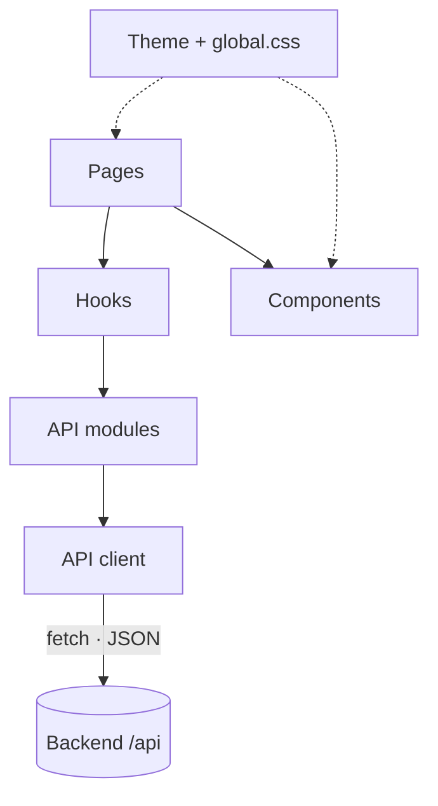
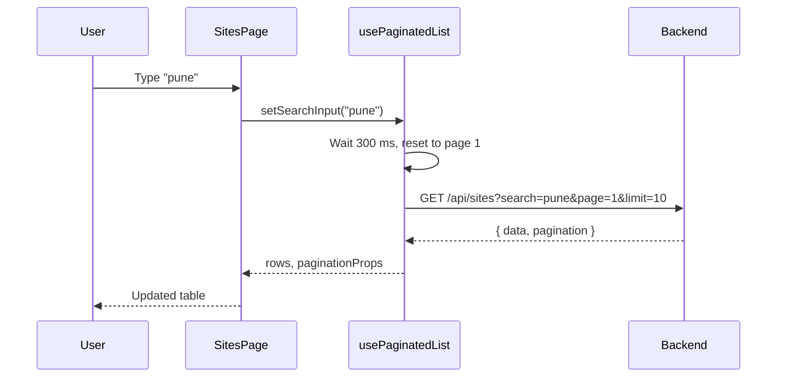
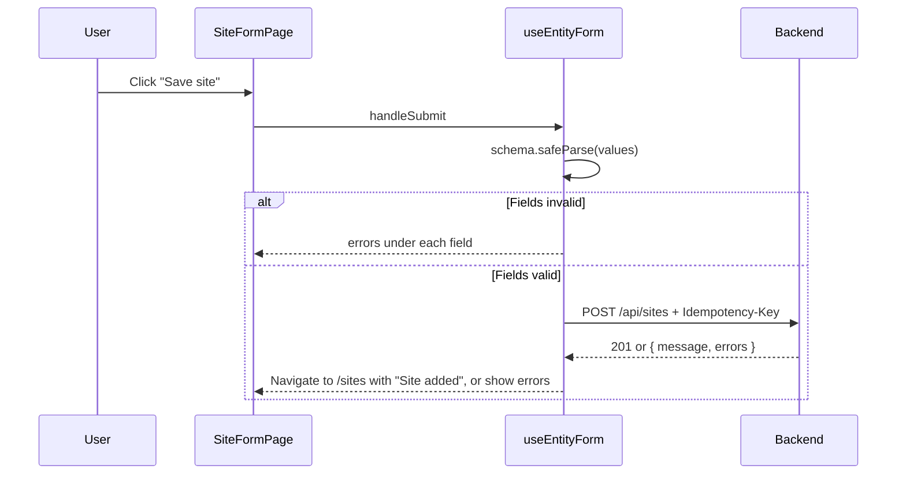

# Frontend

The frontend is a React single-page application built with Vite and Material UI. It shows the dashboard, lets users search, filter and edit sites and installations, and talks to the backend only through the REST API.

## Stack

| Concern | Library | Purpose |
|---|---|---|
| UI library | `react` 19 | Components and hooks |
| Build tool | `vite` | Development server, `/api` proxy and production build |
| Routing | `react-router-dom` 7 | Page URLs, links and navigation |
| Components | `@mui/material` 9 | Layout, tables, forms, dialogs, alerts |
| Icons | `@mui/icons-material` | Material SVG icons |
| Charts | `@mui/x-charts` | Donut and bar charts on the Overview page |
| Styling engine | `@emotion/react`, `@emotion/styled` | Required by Material UI |
| Validation | `zod` 4 | Form schemas that mirror the backend's |

HTTP requests use the browser's built-in `fetch`; no extra HTTP library is needed.

## Folder structure

```
frontend/
├── index.html                    HTML entry, loads IBM Plex Sans
├── vite.config.js                React plugin and /api proxy to localhost:5000
├── .env.example                  VITE_API_URL for deployed builds
├── public/
│   ├── favicon.svg
│   └── staticwebapp.config.json  Azure Static Web Apps route fallback
└── src/
    ├── main.jsx                  Theme, CSS baseline and router
    ├── App.jsx                   Routes, each page loaded on demand
    ├── constants.js              Statuses, regions, colours, page sizes
    ├── utils.js                  Date helpers
    ├── api/                      One module per resource and a shared client
    ├── hooks/                    Reusable state logic
    ├── validation/               Zod form schemas mirroring backend/src/validators
    ├── components/               Reusable UI pieces
    ├── pages/                    One component per screen
    └── styles/
        ├── theme.js              Palette, typography and component overrides
        └── global.css            Layout classes
```

## Architecture



| Layer | Folder | Responsibility | Knows about |
|---|---|---|---|
| Pages | `src/pages` | Compose a screen from hooks and components | Hooks, components |
| Components | `src/components` | Display data and raise events | Props only |
| Hooks | `src/hooks` | Hold state, load data, handle forms and dialogs | API modules |
| API modules | `src/api` | One function per endpoint | API client |
| API client | `src/api/client.js` | Build the URL, send the request, turn failures into messages | `fetch` |

Components never call the API, and the API layer never touches the UI. Each layer can be read and changed on its own.

## Routes

| URL | Page | Purpose |
|---|---|---|
| `/` | `OverviewPage` | Summary cards, status donut chart, monthly bar chart, recent installations |
| `/sites` | `SitesPage` | Site list with search, status and region filters, pagination, delete |
| `/sites/new` | `SiteFormPage` | Create a site |
| `/sites/:id/edit` | `SiteFormPage` | Edit a site |
| `/installations` | `InstallationsPage` | Installation list with search, site and status filters, pagination, delete |
| `/installations/new` | `InstallationFormPage` | Create an installation |
| `/installations/:id/edit` | `InstallationFormPage` | Edit an installation |
| any other URL | `NotFoundPage` | "Page not found" with a link back |

Every page is loaded with `React.lazy`, so the browser downloads a page's code, including the chart library, only when that page is opened.

## Pages

| Page | Uses | Shows |
|---|---|---|
| `OverviewPage` | `getSummary`, `PieChart`, `BarChart`, `InstallationTable` | Four stat cards, installations by status, installations per month, the five latest installations |
| `SitesPage` | `usePaginatedList`, `useDeleteConfirmation`, `useFlashMessage`, `SiteTable` | Searchable, filterable, paginated sites with edit and delete |
| `SiteFormPage` | `useEntityForm` | Name, city, region and status fields |
| `InstallationsPage` | `usePaginatedList`, `useDeleteConfirmation`, `useFlashMessage`, `InstallationTable` | Searchable, filterable, paginated installations with edit and delete |
| `InstallationFormPage` | `useEntityForm`, `getSites`, `getTechnicians` | Equipment, site, technician, date and status fields |
| `NotFoundPage` | — | Message and a link to the Overview |

## Components

| Component | Purpose | Used by |
|---|---|---|
| `Layout` | Sidebar `Drawer` (fixed on desktop, slide-in on mobile), top `AppBar` with the page title and Add button, page area | Every page |
| `SiteTable` | Sites table with status chips, installation counts, edit and delete buttons | Sites page |
| `InstallationTable` | Installations table; edit and delete buttons appear only when `onDelete` is passed | Overview, Installations page |
| `StatusChip` | Coloured status label | Both tables |
| `SearchField` | Text field with a search icon | Both list pages |
| `FilterSelect` | Dropdown with an "All …" option | Both list pages |
| `DeleteDialog` | Confirmation dialog with a deleting state and an inline error | Both list pages |
| `SuccessSnackbar` | Green confirmation message at the bottom of the screen | Both list pages |
| `ErrorAlert` | Red message with optional Retry and Back buttons | Overview, list pages, form pages |
| `ErrorBoundary` | Replaces a crashed page with a recovery message instead of a blank screen | `Layout` |

## Hooks

| Hook | Holds | Returns |
|---|---|---|
| `usePaginatedList(fetchList, initialFilters)` | Search text, filters, page, page size, rows, loading and error state | `rows`, `filters`, `searchInput`, `setSearchInput`, `updateFilter`, `paginationProps`, `reload`, `refreshAfterDelete` |
| `useEntityForm(options)` | Form values, field errors, load and submit state, the idempotency key | `values`, `errors`, `isEditing`, `isLoading`, `loadError`, `submitError`, `isSubmitting`, `handleChange`, `handleSubmit` |
| `useDeleteConfirmation({ deleteRequest, onDeleted })` | The item being deleted, deleting state, error | `item`, `open`, `dialogProps` |
| `useFlashMessage()` | A success message passed from another page | `message`, `showMessage`, `clearMessage` |

The hooks return ready-made props for Material UI components, so connecting them takes one line:

```jsx
<TablePagination component="div" {...sites.paginationProps} />
<DeleteDialog {...deletion.dialogProps} title="Delete site?" message="…" />
```

## Data flow

### Lists



- Search waits 300 ms after the last keystroke, so typing a word sends one request instead of one per letter.
- Changing search, a filter or the page size returns to page 1.
- Responses that arrive after a newer request has started are ignored, so a slow old response never replaces newer results.
- Pagination, search and filtering run on the server; the browser only holds the current page.

### Forms



- Each form is checked with a Zod schema before sending, for instant feedback. The schema also trims text and turns dropdown values into the types the API expects, such as `"3"` into `3` and an empty technician into `null`.
- Errors returned by the server appear under the matching field.
- Each form creates one `Idempotency-Key` when it opens and sends it with every submit, so a repeated click or retry never creates a duplicate.
- After saving, the form returns to the list and the list shows "Site added" or "Installation updated".

## API layer

`src/api/client.js` is the only place that calls `fetch`.

| Behaviour | Detail |
|---|---|
| Base URL | `VITE_API_URL` + `/api`. Locally `VITE_API_URL` is empty and Vite forwards `/api` to `http://localhost:5000` |
| Query strings | Built from an object; empty values are left out |
| Headers | `Content-Type: application/json` when there is a body, `Idempotency-Key` on create requests |
| Timeout | 15 seconds |
| Empty responses | `204 No Content` returns `null` |
| Errors | Every failure becomes an `ApiError` with `message`, `status` and field `errors` |

| Failure | Message shown |
|---|---|
| No connection | Cannot reach the server. Check your connection and try again. |
| No response within 15 seconds | The server is taking too long to respond. Please try again. |
| Field errors from the server | Please fix the highlighted fields. |
| 503 | The service is temporarily unavailable. Please try again shortly. |
| Other 5xx | Something went wrong. Please try again. (Reference: first 8 characters of `X-Request-Id`) |
| Other 4xx | The server's message, such as "A site with this name already exists." |

The reference code matches the `X-Request-Id` in the backend log, so a reported error can be found in the logs.

## Validation

| File | Checks | Mirrors |
|---|---|---|
| `validation/siteSchema.js` | Name and city required and length-limited, region and status from the allowed lists | `backend/src/validators/siteSchemas.js` |
| `validation/installationSchema.js` | Equipment required, site required, technician optional, `YYYY-MM-DD` date, status from the allowed list | `backend/src/validators/installationSchemas.js` |
| `validation/commonSchemas.js` | Shared rules (`requiredText`, `positiveId`, `optionalId`) and `toFieldErrors`, which turns Zod issues into `{ field: message }` | `backend/src/validators/commonSchemas.js` |

The frontend and backend use the same Zod version, the same rules and the same messages, kept as two copies so each side builds and deploys on its own. When a rule or message changes, change both. The browser check gives instant feedback; the server check is the one that counts, because any request can bypass the browser. Checks that need the database, such as a duplicate site name, happen only on the server and appear under the matching field.

## Error handling

| Situation | Where it appears |
|---|---|
| Overview fails to load | `ErrorAlert` with Retry instead of the page |
| A list fails to load | `ErrorAlert` with Retry above the table |
| Site options for the installation filter fail to load | Yellow warning above the table |
| A form field is invalid | Red text under the field |
| Saving fails | `ErrorAlert` at the top of the form |
| An edit page cannot load its record | `ErrorAlert` with a Back button |
| Deleting fails | Error inside the delete dialog, which stays open |
| A component crashes while rendering | `ErrorBoundary` shows Reload and Back to overview; the sidebar keeps working |
| Unknown URL | `NotFoundPage` |

## Styling

Styling lives in two files, and components use no inline styles or `sx` props.

| File | Contains |
|---|---|
| `styles/theme.js` | `COLORS`, the palette, IBM Plex Sans typography and `styleOverrides` for Material UI components: the dark sidebar, outlined cards, uppercase table headers, tinted status chips, rounded inputs and buttons |
| `styles/global.css` | Layout classes such as `app-layout`, `app-page-title`, `chart-card`, `donut-legend`, `toolbar-search`, `form-actions` and `text-strong` |

`main.jsx` wraps the app in `StyledEngineProvider injectFirst`, so Material UI's styles load first and the classes in `global.css` can adjust them without `!important`.

Material UI 9 removed shortcut style props such as `flexGrow`, `fontWeight`, `alignItems` and `justifyContent` from `Typography` and `Stack`; they are ignored without an error. Use a class in `global.css` instead.

### Colours

| Token | Value | Used for |
|---|---|---|
| `sidebar` | `#16202e` | Sidebar background |
| `primary` | `#2457d6` | Buttons, links, bar chart |
| `page` | `#f3f5f8` | Page background |
| `border` | `#e1e5eb` | Card and table borders |
| `success` | `#1e8a4c` | Completed, Active |
| `warning` | `#b86e00` | In Progress |
| `danger` | `#c4372b` | Inactive, errors |
| `neutral` | `#5f6b7a` | Pending, secondary text |

### Responsive layout

| Width | Behaviour |
|---|---|
| 900 px and wider | Fixed sidebar, four stat cards per row, charts side by side |
| Below 900 px | Sidebar becomes a slide-in menu opened from the top bar |
| Below 600 px | Stat cards and form fields stack in one column; tables scroll sideways |

## Configuration

| Variable | When | Purpose |
|---|---|---|
| `VITE_API_URL` | Production builds only | Backend address without `/api`, for example `https://siteops-dashboard-fj-api.azurewebsites.net`. Vite writes it into the build, so the frontend is rebuilt when it changes |

Locally no `.env` file is needed: `vite.config.js` forwards `/api` to `http://localhost:5000`.

## Scripts

Run from the `frontend` folder.

| Command | Description |
|---|---|
| `npm run dev` | Start the development server at `http://localhost:5173` |
| `npm run build` | Build the production bundle into `dist` |
| `npm run preview` | Serve the production build locally |

## Deployment

The production build is deployed to Azure Static Web Apps. `public/staticwebapp.config.json` sends every route to `index.html`, so refreshing a page such as `/sites/3/edit` works. Build and deployment commands are in [deployment.md](deployment.md).
